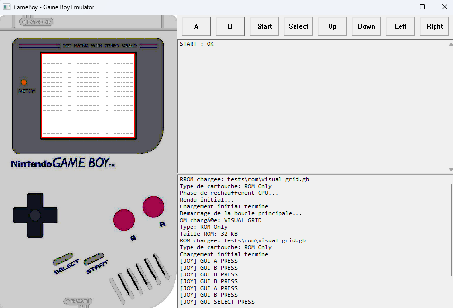
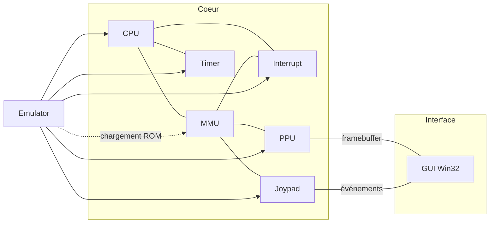
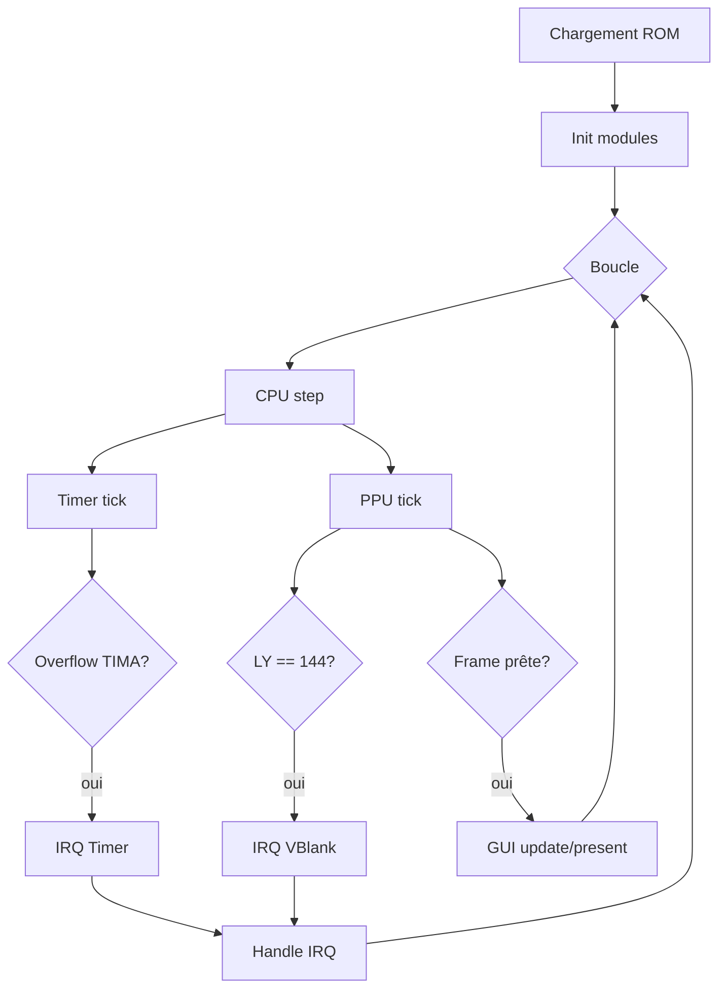

# CameBoy – Émulateur Game Boy (DMG)



Émulateur Game Boy en C99, conçu pour suivre les spécifications Pan Docs et viser la conformité aux suites de tests Blargg/Mooneye. Deux modes d’exécution sont fournis: console et GUI Win32.

### Documentation

- Index documentation: `docs/README.md`
- Architecture: `docs/architecture.md`
- Utilisation (build/run/GUI): `docs/usage.md`
- Tests (unitaires, ROM, logs): `docs/testing.md`
- Scripts (cameboy.bat, user/*.bat): `docs/scripts.md`
- Glossaire (jargon expliqué): `docs/glossaire.md`
- Contribution: `CONTRIBUTING.md`

### Structure du projet (vue rapide)

```text
src/                    # CPU, MMU, PPU, Timer, Joypad, Interrupt, APU, GUI
tests/                  # unit, blargg, mooneye, rom
build/                  # artefacts (généré)
logs/                   # logs (généré)
resources/              # assets GUI (copiés en build/resources)
```

### Prérequis

- Windows avec `gcc` (MinGW/TDM-GCC) dans le PATH. Linux/macOS possibles via `make`.

### Démarrage rapide (Windows)

```cmd
cameboy.bat            :: build + tests
cameboy.bat run rom.gb :: exécuter en console
cameboy.bat gui rom.gb :: exécuter en GUI
type logs\test_results.log | more
```

#### Table des matières

- [Documentation](#documentation)
  - [Index docs](docs/README.md)
  - [Architecture](docs/architecture.md)
  - [Utilisation](docs/usage.md)
  - [Tests](docs/testing.md)
  - [Scripts](docs/scripts.md)
  - [Glossaire](docs/glossaire.md)
  - [Pan Docs (copie locale)](docs/pandocs/)
- [Structure du projet (vue rapide)](#structure-du-projet-vue-rapide)
- [Prérequis](#prérequis)
- [Démarrage rapide (Windows)](#démarrage-rapide-windows)
- [Références](#références)
- [État & objectifs](#état--objectifs)

Les exécutables sont générés sous `build\bin\`.

### Références

- Pan Docs (site officiel): [gbdev.io/pandocs](https://gbdev.io/pandocs/)
- Pan Docs (copie locale du repo): `docs/pandocs/`
- Suites de tests: `tests/blargg/`, `tests/mooneye/`

### État & objectifs

Voir `README_AGENT.md` pour un état technique courant (timings PPU/Timer/Joypad) et prochaines étapes.

### Aperçu visuel




