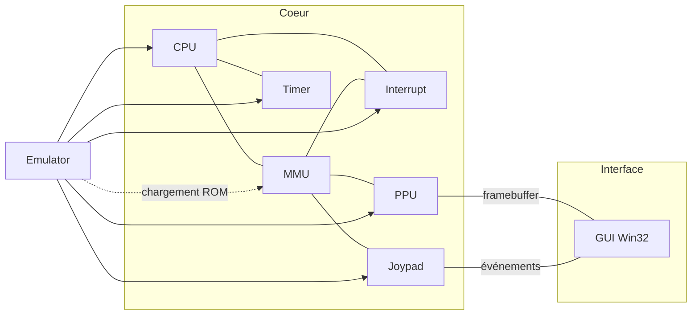
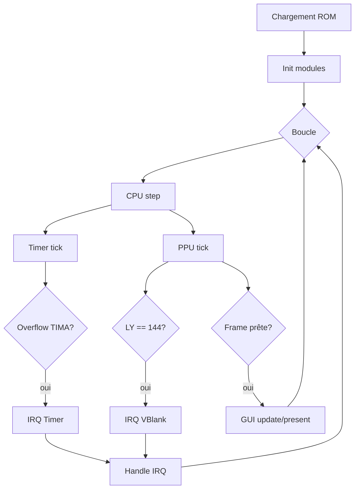

# CameBoy – Émulateur Game Boy (DMG)


CameBoy est un émulateur Game Boy écrit en C99, conçu pour être pédagogique. Le projet s’appuie sur les Pan Docs pour la fidélité matérielle, vise la compatibilité avec les suites de tests Blargg et Mooneye, et fournit deux expériences complémentaires: une version console pour le développement et l’automatisation (build/tests/logs), et une GUI Win32 simple pour visualiser le framebuffer, le port série et les logs en direct. L’architecture reste modulaire (CPU, MMU, PPU, Timer, Interrupts, Joypad, APU) afin de faciliter l’itération, la mesure des timings et l’ajout de fonctionnalités (MBC, DMA, audio…).

Émulateur Game Boy en C99, conçu pour suivre les spécifications Pan Docs et viser la conformité aux suites de tests Blargg/Mooneye. Deux modes d’exécution sont fournis: console et GUI Win32.

### Documentation

- [Index documentation](docs/README.md)
- [Architecture](docs/architecture.md)
- [Utilisation (build/run/GUI)](docs/usage.md)
- [Tests (unitaires, ROM, logs)](docs/testing.md)
- [Scripts (cameboy.bat, user/*.bat)](docs/scripts.md)
- [Glossaire (jargon expliqué)](docs/glossaire.md)
- [Spécifications d'implémentation](docs/specs/README.md)
- [Contribution](CONTRIBUTING.md)

► Parcours conseillé: Utilisation → Architecture → Spécifications → Tests

### Structure du projet (vue rapide)

```text
src/                    # CPU, MMU, PPU, Timer, Joypad, Interrupt, APU, GUI
tests/                  # unit, blargg, mooneye, rom
build/                  # artefacts (généré)
logs/                   # logs (généré)
resources/              # assets GUI (copiés en build/resources)
```

### Prérequis

- Windows avec `gcc` (MinGW/TDM-GCC) dans le PATH. Linux/macOS possibles via `make`.

### Démarrage rapide (Windows)

```cmd
cameboy.bat            :: build + tests
cameboy.bat run rom.gb :: exécuter en console
cameboy.bat gui rom.gb :: exécuter en GUI
type logs\test_results.log | more
```

#### Sommaire complet

- [Index docs](docs/README.md)
- [Utilisation](docs/usage.md)
- [Architecture](docs/architecture.md)
- [Spécifications d'implémentation](docs/specs/README.md)
  - [Mémoire](docs/specs/memory.md)
  - [CPU](docs/specs/cpu.md)
  - [PPU](docs/specs/ppu.md)
  - [Timers](docs/specs/timers.md)
  - [Interruptions](docs/specs/interrupts.md)
  - [Joypad](docs/specs/joypad.md)
  - [Port Série](docs/specs/serial.md)
  - [MBC](docs/specs/mbc.md)
  - [DMA/OAM](docs/specs/dma.md)
  - [Accès VRAM/OAM](docs/specs/vram-access.md)
  - [Séquence de démarrage](docs/specs/power-up.md)
  - [APU (Audio)](docs/specs/apu.md)
  - [Bug de corruption OAM](docs/specs/oam-bug.md)
  - [CGB (Game Boy Color)](docs/specs/cgb.md)
- [ROMs (format/lecture/build)](docs/roms.md)
- [Tests](docs/testing.md)
- [Scripts](docs/scripts.md)
- [Glossaire](docs/glossaire.md)
- [Contribution](CONTRIBUTING.md)
- Pour en savoir plus (optionnel): Super Game Boy, Infrarouge, Accessoires, Connectique, Cheats, Comparaison Z80 (voir Pan Docs)
- [Pan Docs (site officiel)](https://gbdev.io/pandocs/)

Les exécutables sont générés sous `build\bin\`.

### Références

- [Pan Docs (site officiel)](https://gbdev.io/pandocs/)
- Suites de tests: `tests/blargg/`, `tests/mooneye/`

### État & objectifs

Voir `README_AGENT.md` pour un état technique courant (timings PPU/Timer/Joypad) et prochaines étapes.

### Aperçu visuel




