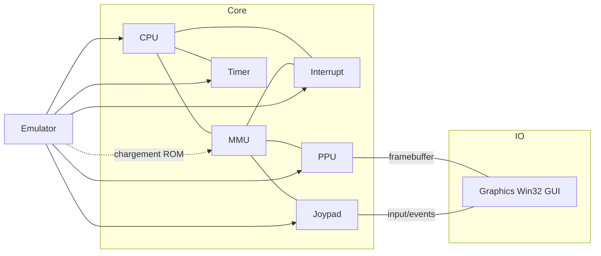
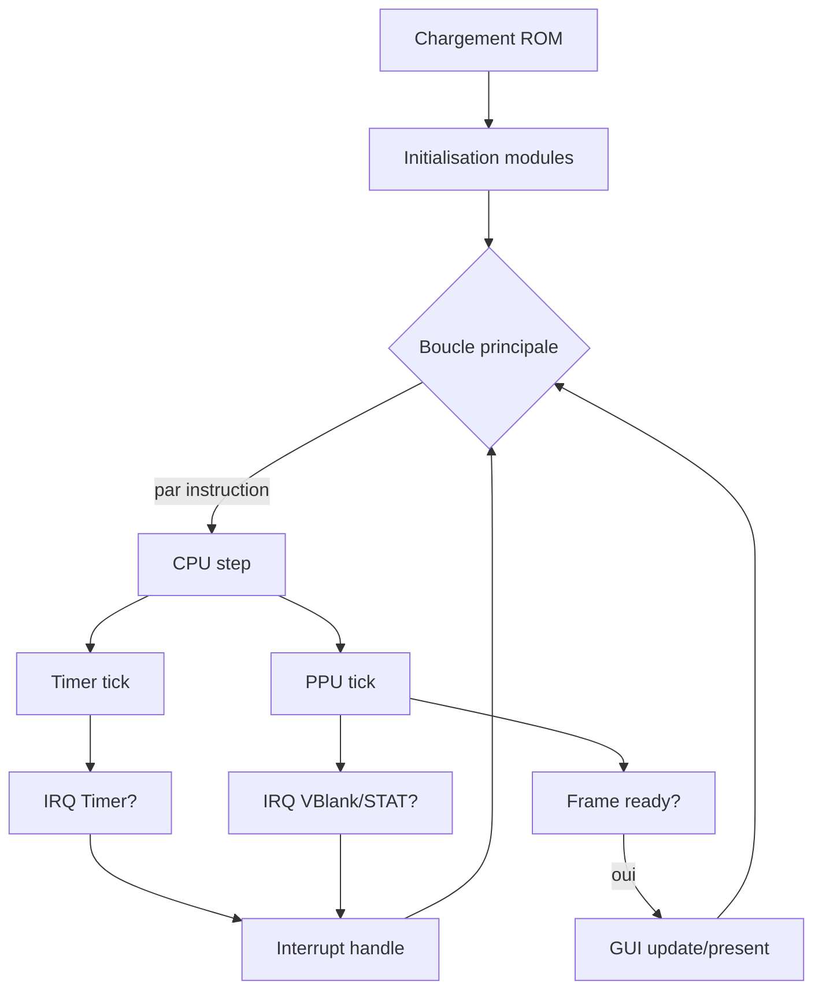
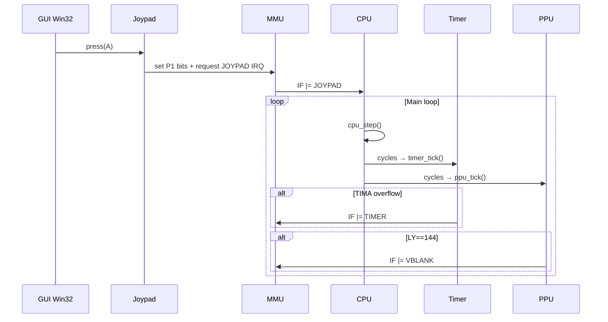

Retour à l’index: [docs/README.md](./README.md) · [Utilisation](./usage.md) · [Tests](./testing.md) · [Scripts](./scripts.md) · [Glossaire](./glossaire.md)

### Architecture de CameBoy

Ce document décrit l'architecture logique de l'émulateur Game Boy CameBoy, en expliquant les composants, leurs responsabilités et leurs interactions. Le jargon est défini au fur et à mesure.

### Vue d'ensemble

- **CPU (LR35902)**: processeur 8-bit de la Game Boy. Il exécute les instructions (fetch/decode/execute), gère les registres et les drapeaux (flags Z/N/H/C).
- **MMU (Memory Management Unit)**: bus mémoire. Il mappe les adresses vers les bonnes zones (ROM, VRAM, WRAM, IO, etc.), gère les accès aux registres IO et le chargement de ROM.
- **PPU (Picture Processing Unit)**: moteur vidéo. Il génère l'image (160x144) ligne par ligne et gère les modes (OAM, Transfert, HBlank, VBlank).
- **Timer (DIV/TIMA/TMA/TAC)**: minuteries système. Le timer peut déclencher des interruptions à des fréquences précises.
- **Interrupt**: gestionnaire d'interruptions. Priorise et sert VBlank, LCD STAT, Timer, Série, Joypad.
- **Joypad**: gestion des entrées utilisateur via le registre `P1` (sélection lignes boutons/directions) et génération d'IRQ Joypad.
- **APU (Audio Processing Unit)**: audio (partiel/placeholder dans ce projet).
- **Couche OS/GUI**: rendu Win32, fenêtre GUI et contrôles (option GUI), version simple console (option RUN).

### Diagramme des dépendances (logiques)

### Flux d'exécution (simplifié)

### Composants et responsabilités

- **`src/cpu.h` / `src/cpu.c`**
  - Décodage via tables `cpu_tables.c` et `cpu_tables_cb.c` (préfixe CB).
  - Respect des drapeaux: Z (Zero), N (Substract), H (Half-carry), C (Carry).
  - Points d'attention: délai d'activation `EI` (prend effet après l'instruction suivante), bug `HALT` (PC peut ne pas s'incrémenter si des IRQ en attente avec IME=0).

- **`src/mmu.h` / `src/mmu.c`**
  - Mapping mémoire: ROM(0x0000-7FFF) / VRAM(0x8000-9FFF) / ERAM / WRAM / OAM / IO / HRAM.
  - Registres IO principaux exposés dans `src/common.h` (ex: `LCDC`, `STAT`, `DIV`, `TIMA`, `IE`, `IF`).
  - Chargement de ROM, appel du callback série (redirige vers GUI) et intéraction avec Joypad/PPU/Timer.

- **`src/ppu.h` / `src/ppu.c`**
  - Pipeline vidéo: 456 cycles par ligne, 144 lignes visibles, 10 lignes VBlank.
  - Modes: OAM Search → Pixel Transfer → HBlank → VBlank, avec transitions STAT.
  - Sortie: `framebuffer` 160x144 en pixels 32-bit, consommé par la GUI.

- **`src/timer.h` / `src/timer.c`**
  - Registres: `DIV`, `TIMA`, `TMA`, `TAC`.
  - Overflow de `TIMA` → reload depuis `TMA` et demande d'IRQ Timer.

- **`src/interrupt.h` / `src/interrupt.c`**
  - Bits d'`IF`/`IE`, priorités, acquittement et saut vers routines d'interruption.

- **`src/joypad.h` / `src/joypad.c`**
  - Registre `P1` (sélection lignes boutons/directions et lecture 4 bits bas).
  - Déclenchement IRQ Joypad via callback vers MMU.

- **`src/graphics_win32_gui.*`**
  - Fenêtre Win32 avec 3 zones: console (fond + LCD), panneau série, panneau logs, et une barre d'actions (boutons A/B/Start/Select/D-pad).
  - Affichage du `framebuffer` PPU et gestion des entrées clavier/boutons.
  - Les logs GUI proviennent de la redirection stdout/stderr (voir exécution) et du callback série.

- **`src/emulator_win32_gui.c`**
  - Intègre tous les modules, redirige stdout/stderr vers le panneau logs, et publie la sortie série dans le panneau série.
  - Boucle d'émulation: `cpu_step` → `timer_tick` → `ppu_tick` → rendu périodique (≈60 FPS) → gestion événements.

- **`src/emulator_simple.c`**
  - Version console minimale (sans GUI) pour lancer une ROM, produire des logs et éventuellement des captures simples.

### Diagramme séquence (événements clés)

### Ports, logs et ressources

- Les ressources GUI (fond Game Boy) se trouvent dans `resources/` et sont copiées en `build/resources/` au build.
- La GUI capte la sortie standard et d'erreur pour les afficher dans le panneau de logs, et le port série est affiché séparément.
- Les logs par ROM sont écrits sous `logs/rom/<romname>/` lors du chargement dans la GUI.

### Limitations/points d'attention actuels

- PPU/Timer/Joypad peuvent nécessiter des ajustements de timing pour satisfaire Blargg/Mooneye (voir `README_AGENT.md`).
- DMA OAM et certains MBC ne sont pas implémentés/complétés.

