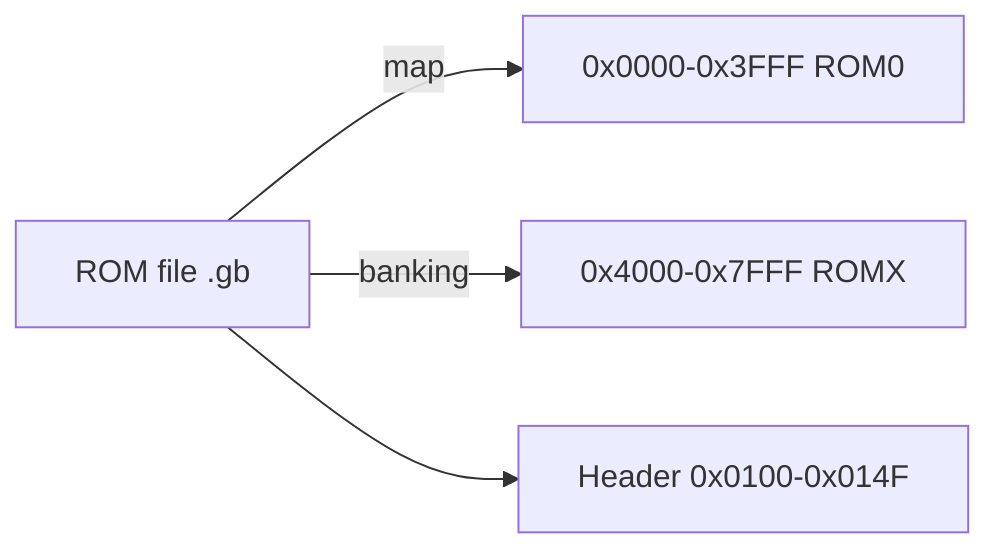
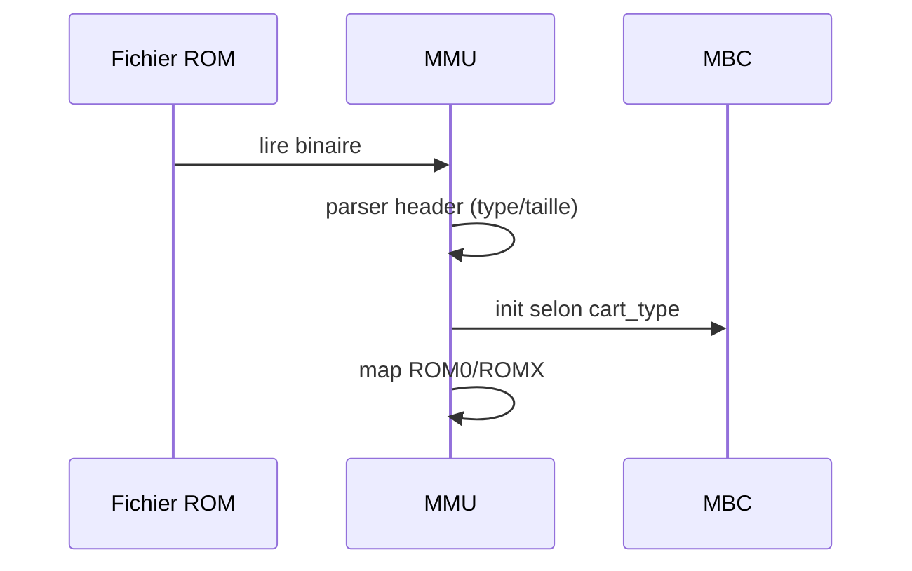

# ROMs Game Boy – Format, lecture, et construction

Retour: [Index docs](./README.md) · [Architecture](./architecture.md)

## Qu’est-ce qu’une ROM ? (non-expert)
Une ROM est un fichier binaire (ex: `.gb`) contenant le programme du jeu. L’émulateur lit ce fichier et l’exécute comme si c’était une cartouche insérée dans la console.

## Vue d’ensemble (expert)
- Fichier binaire mappé en mémoire à partir de 0x0000 (ROM0/ROMX)
- En-tête cartouche à 0x0100–0x014F (logo, titre, type, tailles, checksums)
- Éventuel contrôleur MBC pour banques ROM/RAM



## En-tête de cartouche (header)
Adresse 0x0100–0x014F. Champs principaux:
- 0x0104–0x0133: Logo Nintendo (doit matcher)
- 0x0134–0x0143: Titre (16 bytes)
- 0x0147: Type de cartouche (détermine MBC)
- 0x0148: Taille ROM (code -> nb de banques)
- 0x0149: Taille RAM (code -> taille totale)
- 0x014D: Header checksum
- 0x014E–0x014F: Global checksum

Réf: [Pan Docs – The Cartridge Header](https://gbdev.io/pandocs/The_Cartridge_Header.html)

## Lecture par l’émulateur

### Chargement
- Lecture du fichier `.gb` en mémoire
- Parsing de l’en-tête pour identifier `cart_type`, `rom_size`, `ram_size`
- Sélection du MBC (MBC1/MBC3/MBC5…) si nécessaire
- Initialisation des banques (ROM0/ROMX, RAM externe)



### Accès mémoire
- 0x0000–0x3FFF: ROM banc 0
- 0x4000–0x7FFF: ROM banc sélectionné (MBC)
- Écritures dans 0x0000–0x7FFF utilisées par MBC pour changer de banc/activer RAM/RTC

Réf: [Pan Docs – Memory Map](https://gbdev.io/pandocs/Memory_Map.html), [MBCs](https://gbdev.io/pandocs/MBCs.html)

## Construire des ROMs (homebrew)
Deux toolchains populaires:

### 1) RGBDS (assembleur)
- Outils: `rgbasm` (assemble), `rgblink` (link), `rgbfix` (header/checksum)
- Fichiers source: `.asm` + includes `.inc`

Exemple Makefile minimal:
```make
# make
rom.gb: main.o
	rgblink -o $@ $^
	rgbfix -v -p 0 $@

%.o: %.asm
	rgbasm -o $@ $<
```

Exemple `main.asm` minimal:
```asm
SECTION "Entry", ROM0[$0100]
  nop
  jp Start

SECTION "Code", ROM0
Start:
  ; votre code ici
  jr Start
```

- `rgbfix -p 0` fixe le padding et le header pour DMG.
- Docs: `https://rgbds.gbdev.io/`

### 2) GBDK (C)
- SDK en C pour Game Boy
- Compiler du C en ROM `.gb`

Exemple (ligne de commande):
```bash
lcc -o build/hello.gb src/hello.c
```

`hello.c` minimal:
```c
#include <gb/gb.h>
#include <stdio.h>

void main() {
  printf("Hello, GB!\n");
  while(1) wait_vbl_done();
}
```

- Docs: `https://gbdk-2020.github.io/`

## Bonnes pratiques
- Respecter l’en-tête (logo, tailles, checksums) pour compatibilité maximale
- Choisir MBC adapté (taille ROM/RAM)
- Éviter d’écrire dans 0x0000–0x7FFF sauf pour commandes MBC
- Tester sur émulateurs et si possible sur hardware

## ROMs de test (répertoire du projet)
- `tests/rom/*.gb`: petites ROMs de debug/visuel/série
- `tests/blargg/`, `tests/mooneye/`: suites de conformité

## Références
- [Pan Docs – The Cartridge Header](https://gbdev.io/pandocs/The_Cartridge_Header.html)
- [Pan Docs – MBCs](https://gbdev.io/pandocs/MBCs.html)
- [RGBDS](https://rgbds.gbdev.io/) · [GBDK-2020](https://gbdk-2020.github.io/)
