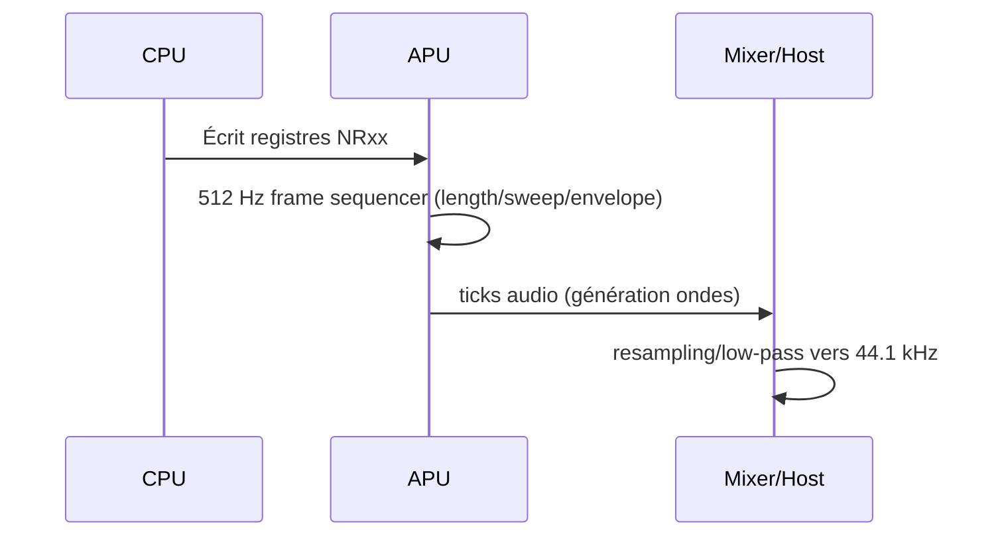

# APU (Audio Processing Unit) - Spécifications d'implémentation

Retour: [Index specs](./README.md) | [Architecture](../architecture.md)

## Vue d'ensemble

L'APU de la Game Boy génère le son via 4 canaux:
- Canal 1: onde carrée + sweep
- Canal 2: onde carrée
- Canal 3: onde personnalisée (wave)
- Canal 4: bruit (LFSR)

### Pourquoi cette conception ?
- Économie matérielle: générateurs simples (carrée, LFSR) peu coûteux
- Flexibilité: enveloppes de volume, sweep, duty cycle
- Compatibilité: registres mappés mémoire pour contrôle depuis le CPU

## Carte des registres (0xFF10-0xFF3F)

```mermaid
graph TD
  NR10[NR10 (FF10) Sweep C1]
  NR11[NR11 (FF11) Duty/Length C1]
  NR12[NR12 (FF12) Envelope C1]
  NR13[NR13 (FF13) Freq lo C1]
  NR14[NR14 (FF14) Freq hi C1]

  NR21[NR21 (FF16) Duty/Length C2]
  NR22[NR22 (FF17) Envelope C2]
  NR23[NR23 (FF18) Freq lo C2]
  NR24[NR24 (FF19) Freq hi C2]

  NR30[NR30 (FF1A) On/Off C3]
  NR31[NR31 (FF1B) Length C3]
  NR32[NR32 (FF1C) Level C3]
  NR33[NR33 (FF1D) Freq lo C3]
  NR34[NR34 (FF1E) Freq hi C3]

  NR41[NR41 (FF20) Length C4]
  NR42[NR42 (FF21) Envelope C4]
  NR43[NR43 (FF22) Poly/LFSR C4]
  NR44[NR44 (FF23) Control C4]

  NR50[NR50 (FF24) Master Vol]
  NR51[NR51 (FF25) Panning]
  NR52[NR52 (FF26) Master On]

  WAVE[Wave RAM FF30-FF3F]
```

Réf: [Pan Docs - Audio Registers](https://gbdev.io/pandocs/Audio_Registers.html)

## Modèle d'horloge et pas audio

- Fréquence de base: 4.194304 MHz
- Frame sequencer: 512 Hz (pilote length, sweep, enveloppe)
- Sortie audio: échantillonnage côté hôte (mixage à buffer) à une fréquence cible (ex: 44100 Hz)



## Canaux

### Canaux 1 et 2 (onde carrée)
- Duty cycle: 12.5%, 25%, 50%, 75%
- Enveloppe volume: montée/descente à intervalle réglable
- Fréquence: 11 bits (NR13/NR14 ou NR23/NR24)
- Canal 1: sweep (NR10) modifie la fréquence au fil du temps

Implémentation (esquisse):
```c
typedef struct {
  bool enabled; u16 freq; u8 duty; u8 duty_pos;
  u8 volume; u8 envelope_period; bool envelope_inc; u8 envelope_tick;
  u16 length; u8 length_tick;
} SquareChannel;

static inline int8_t square_sample(SquareChannel* ch) {
  static const u8 duty_table[4][8] = {
    {0,1,0,0,0,0,0,0}, {0,1,1,0,0,0,0,0}, {0,1,1,1,1,0,0,0}, {1,0,0,1,1,1,1,1}
  };
  u8 bit = duty_table[ch->duty & 3][ch->duty_pos & 7];
  return bit ? (int8_t)ch->volume : (int8_t)-ch->volume;
}
```

### Canal 3 (wave)
- Wave RAM: 32 échantillons 4-bit (FF30-FF3F)
- Lecture avec facteur d'échelle (NR32)

### Canal 4 (bruit)
- LFSR 15-bit (ou 7-bit) pour générer du bruit
- ParamAtres: clock shift, width mode, divisor (NR43)

## Sequencer 512 Hz

- Atapes sur 8 ticks (0..7):
  - Length: ticks 0,2,4,6
  - Sweep (C1): ticks 2,6
  - Envelope: tick 7

```mermaid
gantt
  dateFormat X
  axisFormat %s
  section FrameSequencer
  Length   :0,1
  (idle)   :1,1
  Length+Sweep :2,1
  (idle)   :3,1
  Length   :4,1
  (idle)   :5,1
  Length+Sweep :6,1
  Envelope :7,1
```



## Mixage et sortie

- NR50: volume gauche/droite master
- NR51: panning des canaux vers L/R
- NR52: master on/off + flags canaux actifs
- Mixer: sommer canaux (avec clipping/scale) a' buffer hAte

## Reset / Power-up

- NR52 bit7=0 a' APU off; Acrire 1 pour activer
- RAinitialiser canaux, buffers, wave RAM

## Tests et conformitA

- ROMs de tests audio (blargg: dmg_sound, cgb_sound)
- VArifier sweep, enveloppes, timing frame sequencer, LFSR

## RAfArences
- [Audio](https://gbdev.io/pandocs/Audio.html)
- [Audio Registers](https://gbdev.io/pandocs/Audio_Registers.html)
- [Audio Details](https://gbdev.io/pandocs/Audio_Details.html)


### Details importants (pedagogique)

- NR52 master on/off: controle global des canaux.
-  DAC off : mettre a 0 le DAC d'un canal le coupe immediatement.
- Sweep (C1): overflow/invalid freq ? canal coupe; horloge 512 Hz (ticks 2/6 du frame sequencer).
- Envelope:  zombie mode  (certaines ecritures relancent l'enveloppe).
- Canal 3 (wave): contraintes d'acces a la Wave RAM selon l'etat de lecture.
- Length counters: horloge 512 Hz (ticks 0/2/4/6), interactions avec trigger.

Refs Pan Docs: Audio, Audio Registers, Audio Details.
