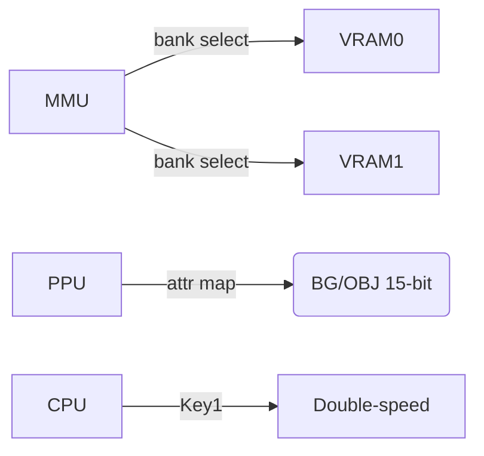

# Game Boy Color (CGB) - Spécificités et cadrage

Retour: [Index specs](./README.md) | [Architecture](../architecture.md)

## Pourquoi une page dédiée ?
CGB introduit des différences majeures par rapport à DMG (couleur, vitesse, mémoire). Même si la cible actuelle est DMG, cadrer le scope CGB aide à planifier l'extension.

## Différences clés vs DMG

- Couleurs: palettes BG/OBJ en 15-bit (RGB555), 8 palettes BG, 8 palettes OBJ
- VRAM: 2 banques (bank 0/1) à tile data/tile maps étendus
- Vitesse: double-speed mode (CPU x2) à impact sur timers/APU/PPU
- OAM/PPU: priorités et attributs étendus (CGB attr map)
- DMA: H-Blank DMA (HDMA) pour transferts pendant HBlank
- Mémoire: WRAM/HRAM étendus (banques WRAM)

## Registres CGB
- Palettes couleur: `0xFF68-0xFF6B` (BG/OBJ index/data)
- VRAM bank: `0xFF4F`
- WRAM bank: `0xFF70`
- Key1 (double-speed): `0xFF4D`

## Impacts d'implémentation

- PPU: pipeline doit gérer attributs CGB (palette index, VRAM bank pour tile data)
- Palettes: gestion des données 15-bit et auto-increment des registres palette
- DMA: implémenter GDMA/HDMA (général/Horizontal-Blank DMA)
- Timers: double-speed affecte les diviseurs (DIV/TIMA)
- MMU: banques supplémentaires (VRAM/WRAM), mapping CGB

## Tests
- Blargg/Mooneye: tests CGB spécifiques (palettes, HDMA, speed)
- Démo homebrew CGB

## Stratégie de migration
1) Stabiliser DMG (CPU/PPU/Timers/IRQ/Joypad)
2) Ajouter VRAM banks + palettes CGB (affichage mono palettes à couleur)
3) Implémenter HDMA + Key1 (double-speed) avec timers ajustés

## Références
- [CGB Registers](https://gbdev.io/pandocs/CGB_Registers.html)
- [VRAM and Palettes (CGB)](https://gbdev.io/pandocs/Rendering.html)
- [HDMA](https://gbdev.io/pandocs/OAM_DMA_Transfer.html)

