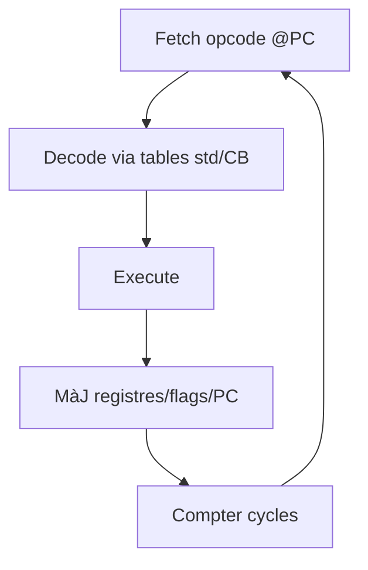
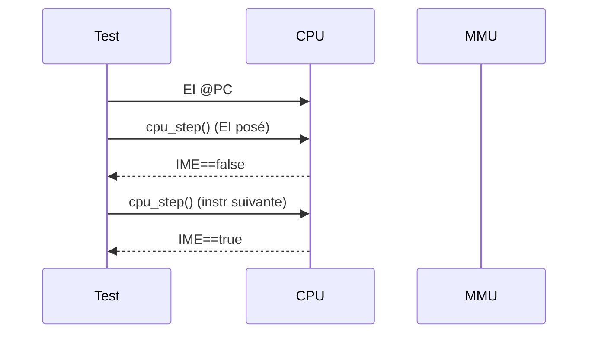

# CPU (LR35902) - Spécifications d'implémentation

Retour: [Index specs](./README.md) | [Architecture](../architecture.md) | [Tests](../testing.md)

## 1) Principe de fonctionnement (Game Boy)

Le LR35902 est un CPU 8-bit (hybride 8080/Z80) cadencé à 4.194304 MHz.
- Registres 8-bit: A, B, C, D, E, H, L (F = flags)
- Registres 16-bit: AF, BC, DE, HL, SP, PC
- Flags: Z (zéro), N (soustraction), H (demi-retenue), C (retenue)
- Interruptions: VBLANK (0x40), LCD STAT (0x48), TIMER (0x50), SERIAL (0x58), JOYPAD (0x60)

### Cycle d'instruction



- EI: l'activation des interruptions prend effet après l'instruction suivante
- HALT: CPU s'arrête jusqu'à interruption; HALT bug si IME=0 et IRQ en attente à PC peut ne pas s'incrémenter

```mermaid
sequenceDiagram
  participant CPU
  participant MMU
  CPU->>MMU: read IE/IF
  alt IME=0 and (IE&IF)!=0
    CPU->>CPU: HALT bug (PC n'avance pas)
  else IME=1 and IRQ en attente
    CPU->>CPU: push PC; IME=0; PC=handler
  end
```

Réfs Pan Docs: CPU, Registers/Flags, Instruction Set, HALT

---

## 2) Logique d'implémentation (CameBoy)

### Structure
- Registres regroupés: `u16 af, bc, de, hl, sp, pc` avec accesseurs 8-bit (A/B/C/D/E/H/L/F)
- État CPU: `halted`, `ime`, `ei_pending` (EI retardé), `halt_bug`, `branch_taken`
- Tables d'opcodes `opcodes[]` et `opcodes_cb[]` (déclarées dans `cpu_tables*.c`)

### Contrôle de flux et interruptions
- EI: `inst_ei` pose `ei_pending`; `cpu_step` active `ime` après l'instruction suivante (conforme EI delay)
- HALT: 
  - si `IME=0` et `IE&IF!=0` à `halt_bug=true`, `halted=false`, `pc` pas incrémenté (bug HALT)
  - sinon `halted=true` et `pc += 1`; `cpu_step` reste à 4 cycles tant qu'aucune IRQ en attente
- Interruptions: `cpu_interrupt` pousse PC, met `IME=0`, `halted=false`, et redirige vers le vecteur; l'intégration est pilotée par l'extérieur (tests/appelle `cpu_interrupt` directement)

### Instructions et flags
- Arithmétiques/logiques: Z/N/H/C mis à jour selon Pan Docs
- DAA: implémentation basée sur `N/H/C` et nibbles de A; assez fidèle pour usage courant (piste d'ajustement fine possible)
- Rotations RLCA/RRCA/RLA/RRA: Z=0 toujours (conforme), mise à jour de C selon bit décalé
- LDH: accès `0xFF00+imm` ou `0xFF00+C` via `mmu_read/write`
- Sauts conditionnels: `branch_taken` détermine `cycles_cond` au retour `cpu_step`

### Hypothèses/choix
- `cpu_step` ne traite pas lui-même la sélection d'IRQ selon IE/IF; c'est la couche d'interruptions/appelant qui invoque `cpu_interrupt` (cohérent avec la structure actuelle du projet)
- Valeurs d'initialisation (post boot ROM): `AF=0x01B0`, `BC=0x0013`, `DE=0x00D8`, `HL=0x014D`, `SP=0xFFFE`, `PC=0x0100`

---

## 3) Stratégie de test (unitaires)

Tests dans `tests/unit/test_cpu.c`:

- Initialisation/Reset
  - `test_cpu_init`, `test_cpu_reset`
- Flags et registres
  - `test_cpu_flags`, `test_cpu_registers`
- Arithmétiques/logiques
  - `test_cpu_arithmetic_add/sub/adc/sbc`, `test_cpu_logical_and/or/xor/cp`
- Chargements et sauts
  - `test_cpu_load_ld_r8_r8/n8`, `test_cpu_load_ld_r16_n16`, `test_cpu_jumps_jr_*`
- Pile
  - `test_cpu_stack_push_pop`
- Interruptions
  - `test_cpu_interrupts`
- Nouveaux tests (précision timing/BCD)
  - `test_cpu_ei_delay`: vérifie l'activation différée de `IME` (EI prend effet après l'instruction suivante)
  - `test_cpu_halt_bug`: vérifie que `HALT` avec `IME=0` et `IE&IF!=0` n'incrémente pas `PC` et active `halt_bug`
  - `test_cpu_daa_cases`: couvre plusieurs cas d'ajustement décimal (N/H/C et nibbles) pour renforcer la conformité de `DAA`



Références: Pan Docs (sections EI delay, HALT, DAA)

### STOP et double-vitesse CGB (KEY1)

STOP a deux comportements selon la preparation et le modele:
- DMG ou CGB sans préparation: STOP met le CPU en veille basse consommation (réveil via joypad). Pour simplifier dans un cadre pédagogique, on peut traiter ceci comme un HALT prolongé.
- CGB avec préparation: si `KEY1` (`0xFF4D`) a `bit0=1` (préparation), l'exécution de STOP bascule la vitesse CPU (bit7 de `KEY1` reflète l'état: 0=normal, 1=double). La bascule efface `bit0` et l'exécution continue sans entrer en veille.

Details `KEY1` (CGB uniquement):
- `bit7` (lecture seule): vitesse actuelle (0 = normal, 1 = double)
- `bit0` (lecture/écriture): préparation de bascule (écrire 1 avant STOP)
- bits 1-6: lecture à 1

Impact: la vitesse double affecte le rythme des sous-systèmes synchronisés au CPU (timers, APU, certaines durées PPU côté hôte). Dans ce projet, on maintient la logique à fréquence CPU fixe et on traite le double-speed comme un facteur d'horloge global à propager au besoin dans les modules concernés.
