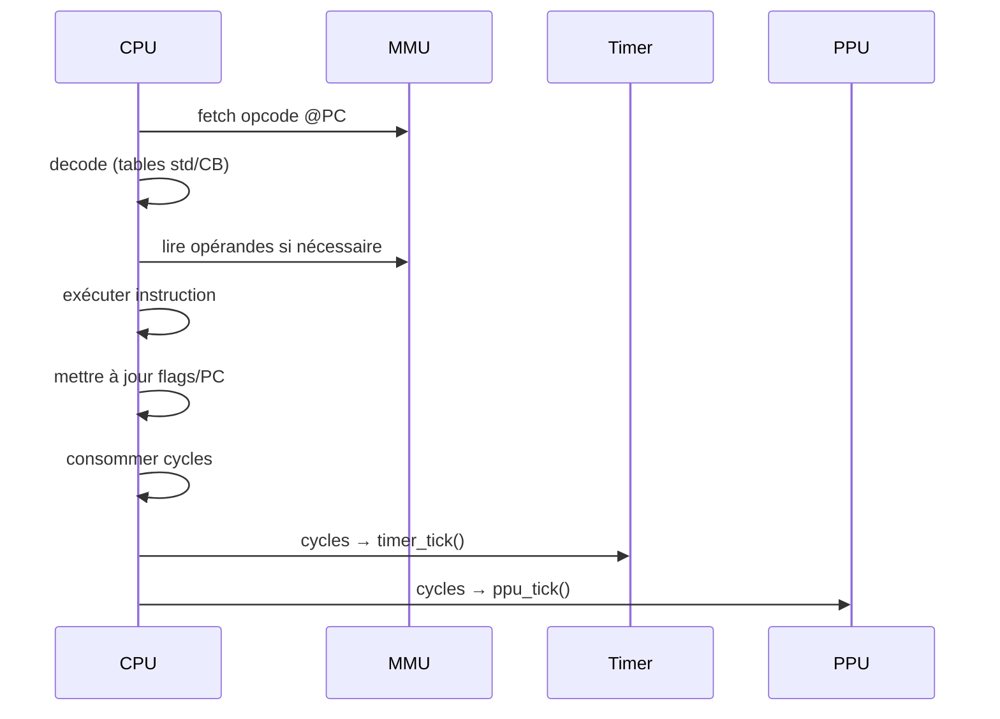

# CPU (LR35902) – Spécifications d'implémentation

Retour: [Index specs](./README.md) · [Architecture](../architecture.md) · [Tests](../testing.md)

## Vue d'ensemble

Le CPU LR35902 est le cœur de la Game Boy. C'est un processeur 8-bit hybride, mélangeant des caractéristiques du 8080 et du Z80, conçu spécifiquement pour la Game Boy.

### Pourquoi cette architecture ?

La Game Boy a été conçue dans les années 1980 avec des contraintes de coût et de consommation. Le LR35902 est un compromis :
- **8-bit** : Plus simple et moins cher que 16-bit
- **Hybride 8080/Z80** : Réutilise des circuits existants
- **Spécifique** : Optimisé pour les besoins de la Game Boy

## Registres et flags

### Registres 8-bit
```c
typedef struct {
    u8 a, b, c, d, e, h, l, f;  // Registres 8-bit
    u16 sp, pc;                 // Registres 16-bit
} CPU;
```

**Pourquoi ces registres ?** L'héritage du 8080/Z80. Chaque registre a un rôle spécifique :
- **A (Accumulator)** : Registre principal pour les calculs
- **B, C, D, E, H, L** : Registres généraux
- **F (Flags)** : Drapeaux d'état
- **SP (Stack Pointer)** : Pointeur de pile
- **PC (Program Counter)** : Compteur de programme

### Registres 16-bit
```c
// Registres 16-bit composés
#define AF (cpu->a << 8 | cpu->f)
#define BC (cpu->b << 8 | cpu->c)
#define DE (cpu->d << 8 | cpu->e)
#define HL (cpu->h << 8 | cpu->l)
```

**Pourquoi cette organisation ?** Économie de circuits. Au lieu d'avoir des registres 16-bit séparés, on compose deux registres 8-bit.

### Flags (drapeaux)
```c
#define FLAG_Z 0x80  // Zero
#define FLAG_N 0x40  // Substract
#define FLAG_H 0x20  // Half-carry
#define FLAG_C 0x10  // Carry
```

**Pourquoi ces flags ?** Ils indiquent l'état des opérations :
- **Z (Zero)** : Résultat = 0
- **N (Substract)** : Opération de soustraction
- **H (Half-carry)** : Retenue sur le 4ème bit
- **C (Carry)** : Retenue sur le 8ème bit

## Cycle d'instruction

### Fetch-Decode-Execute


**Pourquoi cette séquence ?** C'est le cycle classique des processeurs :
1. **Fetch** : Lire l'opcode à l'adresse PC
2. **Decode** : Interpréter l'opcode
3. **Execute** : Exécuter l'instruction
4. **Update** : Mettre à jour les registres et flags

### Tables d'opcodes
```c
// Table principale (opcodes 0x00-0xFF)
typedef struct {
    const char* name;
    u8 cycles;
    u8 cycles_cond;  // Cycles si condition prise
    void (*execute)(CPU* cpu, MMU* mmu);
} Opcode;

// Table CB (opcodes 0xCB00-0xCBFF)
typedef struct {
    const char* name;
    u8 cycles;
    void (*execute)(CPU* cpu, MMU* mmu);
} OpcodeCB;
```

**Pourquoi deux tables ?** Le préfixe CB active une table différente pour les opcodes avancés (rotations, shifts, opérations bit).

## Instructions critiques

### EI (Enable Interrupts)
```c
void op_ei(CPU* cpu, MMU* mmu) {
    cpu->ime = true;  // Activation après l'instruction suivante
}
```

**Pourquoi un délai ?** Sécurité. Si les interruptions étaient activées immédiatement, l'instruction en cours pourrait être interrompue de manière inattendue.

### HALT
```c
void op_halt(CPU* cpu, MMU* mmu) {
    if (cpu->ime) {
        // HALT normal : attendre une interruption
        cpu->halted = true;
    } else {
        // HALT bug : comportement spécial
        if (mmu->if_reg & mmu->ie_reg) {
            // PC peut ne pas s'incrémenter
            cpu->halt_bug = true;
        }
        cpu->halted = true;
    }
}
```

**Pourquoi le HALT bug ?** C'est un défaut matériel de la Game Boy originale. Les jeux s'appuient sur ce comportement, donc il faut l'émuler.

### Instructions de saut
```c
void op_jr(CPU* cpu, MMU* mmu) {
    s8 offset = mmu_read8(mmu, cpu->pc++);
    cpu->pc += offset;  // Saut relatif
}

void op_jp(CPU* cpu, MMU* mmu) {
    u16 addr = mmu_read16(mmu, cpu->pc);
    cpu->pc = addr;  // Saut absolu
}
```

**Pourquoi deux types de saut ?** 
- **JR (Jump Relative)** : Plus compact (1 octet d'offset)
- **JP (Jump Absolute)** : Plus flexible (adresse complète)

## Gestion des interruptions

### Priorité des interruptions
```c
#define IRQ_VBLANK  0x01
#define IRQ_LCD     0x02
#define IRQ_TIMER   0x04
#define IRQ_SERIAL  0x08
#define IRQ_JOYPAD  0x10

u8 get_highest_priority_irq(u8 if_reg, u8 ie_reg) {
    u8 pending = if_reg & ie_reg;
    if (pending & IRQ_VBLANK) return IRQ_VBLANK;
    if (pending & IRQ_LCD) return IRQ_LCD;
    if (pending & IRQ_TIMER) return IRQ_TIMER;
    if (pending & IRQ_SERIAL) return IRQ_SERIAL;
    if (pending & IRQ_JOYPAD) return IRQ_JOYPAD;
    return 0;
}
```

**Pourquoi cette priorité ?** VBlank est critique pour l'affichage, LCD pour le rendu, Timer pour la synchronisation, etc.

### Routine d'interruption
```c
void handle_interrupt(CPU* cpu, MMU* mmu) {
    if (!cpu->ime) return;
    
    u8 irq = get_highest_priority_irq(mmu->if_reg, mmu->ie_reg);
    if (!irq) return;
    
    // Désactiver les interruptions
    cpu->ime = false;
    
    // Effacer le flag d'interruption
    mmu->if_reg &= ~irq;
    
    // Sauvegarder PC sur la pile
    cpu->sp -= 2;
    mmu_write16(mmu, cpu->sp, cpu->pc);
    
    // Sauter à la routine d'interruption
    switch (irq) {
        case IRQ_VBLANK: cpu->pc = 0x40; break;
        case IRQ_LCD: cpu->pc = 0x48; break;
        case IRQ_TIMER: cpu->pc = 0x50; break;
        case IRQ_SERIAL: cpu->pc = 0x58; break;
        case IRQ_JOYPAD: cpu->pc = 0x60; break;
    }
}
```

**Pourquoi sauvegarder PC ?** Pour pouvoir revenir à l'instruction interrompue après le traitement de l'interruption.

## Compteur de cycles

### Cycles par instruction
```c
void cpu_step(CPU* cpu, MMU* mmu) {
    u8 opcode = mmu_read8(mmu, cpu->pc++);
    u8 cycles = opcodes[opcode].cycles;
    
    // Exécuter l'instruction
    opcodes[opcode].execute(cpu, mmu);
    
    // Mettre à jour les composants
    timer_tick(&cpu->timer, cycles);
    ppu_tick(&cpu->ppu, cycles, mmu->vram);
    
    return cycles;
}
```

**Pourquoi compter les cycles ?** La Game Boy fonctionne à 4.194304 MHz. Chaque instruction prend un nombre précis de cycles, nécessaire pour la synchronisation.

### Instructions conditionnelles
```c
bool check_condition(CPU* cpu, u8 condition) {
    switch (condition) {
        case 0: return !(cpu->f & FLAG_Z);  // NZ
        case 1: return (cpu->f & FLAG_Z);   // Z
        case 2: return !(cpu->f & FLAG_C);  // NC
        case 3: return (cpu->f & FLAG_C);   // C
        default: return false;
    }
}
```

**Pourquoi des conditions ?** Permet d'exécuter des instructions seulement si certaines conditions sont remplies (ex: saut si zéro).

## Instructions spéciales

### PUSH/POP
```c
void op_push(CPU* cpu, MMU* mmu, u16 value) {
    cpu->sp -= 2;
    mmu_write16(mmu, cpu->sp, value);
}

u16 op_pop(CPU* cpu, MMU* mmu) {
    u16 value = mmu_read16(mmu, cpu->sp);
    cpu->sp += 2;
    return value;
}
```

**Pourquoi la pile ?** Pour sauvegarder des valeurs temporairement (appels de fonctions, interruptions).

### Instructions CB (préfixe)
```c
void op_cb(CPU* cpu, MMU* mmu) {
    u8 opcode = mmu_read8(mmu, cpu->pc++);
    opcodes_cb[opcode].execute(cpu, mmu);
}
```

**Pourquoi un préfixe ?** Pour étendre l'espace d'opcodes sans augmenter la taille des instructions.

## Initialisation

```c
void cpu_init(CPU* cpu) {
    memset(cpu, 0, sizeof(CPU));
    
    // Valeurs de power-up
    cpu->a = 0x01;
    cpu->f = 0xB0;
    cpu->b = 0x00;
    cpu->c = 0x13;
    cpu->d = 0x00;
    cpu->e = 0xD8;
    cpu->h = 0x01;
    cpu->l = 0x4D;
    cpu->sp = 0xFFFE;
    cpu->pc = 0x0100;  // Démarre après le boot ROM
    
    cpu->ime = false;
    cpu->halted = false;
}
```

**Pourquoi ces valeurs ?** Ce sont les valeurs exactes de la Game Boy au démarrage, importantes pour la compatibilité.

## Références Pan Docs

- [CPU Specifications](https://gbdev.io/pandocs/CPU_Specifications.html)
- [CPU Registers and Flags](https://gbdev.io/pandocs/CPU_Registers_and_Flags.html)
- [CPU Instruction Set](https://gbdev.io/pandocs/CPU_Instruction_Set.html)
- [HALT](https://gbdev.io/pandocs/HALT.html)
