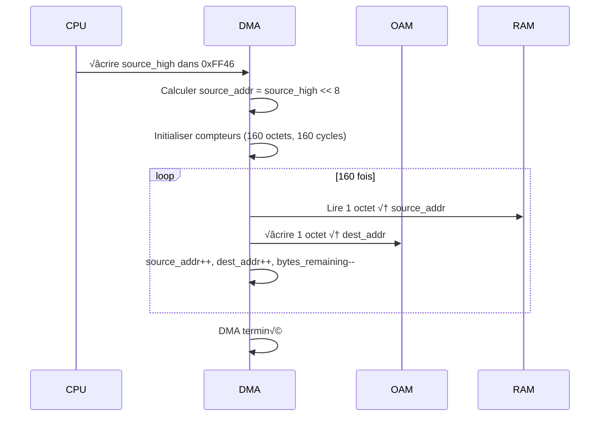

# DMA/OAM – Spécifications d'implémentation

Retour: [Index specs](./README.md) · [Architecture](../architecture.md) · [Utilisation](../usage.md)

## Vue d'ensemble

Le DMA (Direct Memory Access) de la Game Boy permet de copier rapidement des données depuis la RAM vers la mémoire des sprites (OAM). C'est un mécanisme essentiel pour l'animation des sprites.

### Pourquoi le DMA ?

Le DMA OAM est nécessaire car :
- **Performance** : Copie 160 octets en 160 cycles (vs 160 instructions)
- **Synchronisation** : Évite les conflits d'accès pendant le rendu
- **Simplicité** : Une seule instruction pour copier tous les sprites
- **Compatibilité** : Beaucoup de jeux l'utilisent

## Registre DMA (0xFF46)

### Déclenchement du DMA
```c
#define DMA_REG 0xFF46

void dma_start(MMU* mmu, u8 source_high) {
    // L'adresse source est (source_high << 8)
    u16 source_addr = source_high << 8;
    
    // Vérifier que l'adresse source est valide
    if (source_addr < 0x8000 || source_addr >= 0xFE00) {
        return;  // Adresse invalide
    }
    
    // Démarrer le DMA
    mmu->dma.active = true;
    mmu->dma.source_addr = source_addr;
    mmu->dma.dest_addr = 0xFE00;  // OAM
    mmu->dma.bytes_remaining = 160;  // 40 sprites √ó 4 octets
    mmu->dma.cycles_remaining = 160;  // 1 cycle par octet
}
```

**Pourquoi 160 octets ?** C'est la taille exacte de l'OAM (40 sprites √ó 4 octets par sprite).

**Pourquoi 160 cycles ?** Le DMA copie 1 octet par cycle, donc 160 cycles pour 160 octets.

## Processus de copie

### Séquence de copie


### Mise à jour du DMA
```c
void dma_tick(MMU* mmu) {
    if (!mmu->dma.active) return;
    
    // Vérifier si on peut copier un octet
    if (mmu->dma.cycles_remaining > 0) {
        mmu->dma.cycles_remaining--;
        return;
    }
    
    // Copier un octet
    u8 data = mmu_read8(mmu, mmu->dma.source_addr);
    mmu_write8(mmu, mmu->dma.dest_addr, data);
    
    // Passer à l'octet suivant
    mmu->dma.source_addr++;
    mmu->dma.dest_addr++;
    mmu->dma.bytes_remaining--;
    
    // Vérifier si le DMA est terminé
    if (mmu->dma.bytes_remaining == 0) {
        mmu->dma.active = false;
    } else {
        // Réinitialiser le compteur de cycles
        mmu->dma.cycles_remaining = 1;
    }
}
```

**Pourquoi 1 cycle par octet ?** C'est la vitesse exacte du DMA matériel de la Game Boy.

## Restrictions d'accès

### Blocage de l'OAM
```c
bool dma_can_access_oam(MMU* mmu) {
    // Pendant le DMA, l'OAM est inaccessible
    if (mmu->dma.active) {
        return false;
    }
    
    // Vérifier aussi les restrictions PPU
    return ppu_can_access_oam(&mmu->ppu);
}
```

**Pourquoi bloquer l'OAM ?** Pendant le DMA, l'OAM est en cours de modification. Les accès simultanés causeraient des corruptions.

### Blocage partiel du bus
```c
bool dma_can_access_memory(MMU* mmu, u16 addr) {
    if (!mmu->dma.active) return true;
    
    // Pendant le DMA, seules certaines zones sont accessibles
    if (addr >= 0x8000 && addr < 0xFE00) {
        return true;  // VRAM, WRAM, etc.
    }
    
    return false;  // OAM et autres zones bloquées
}
```

**Pourquoi ces restrictions ?** Le DMA utilise le bus mémoire. Certaines zones sont inaccessibles pendant la copie.

## Gestion des accès

### Lecture OAM pendant DMA
```c
u8 mmu_read_oam_during_dma(MMU* mmu, u16 addr) {
    if (mmu->dma.active) {
        // Pendant le DMA, retourner 0xFF
        return 0xFF;
    }
    
    return mmu->oam[addr - 0xFE00];
}
```

**Pourquoi 0xFF ?** C'est le comportement matériel. L'OAM retourne 0xFF pendant le DMA.

### Écriture OAM pendant DMA
```c
void mmu_write_oam_during_dma(MMU* mmu, u16 addr, u8 value) {
    if (mmu->dma.active) {
        // Pendant le DMA, ignorer l'écriture
        return;
    }
    
    mmu->oam[addr - 0xFE00] = value;
}
```

**Pourquoi ignorer ?** Pendant le DMA, l'OAM est en cours de modification. Les écritures sont ignorées.

## Synchronisation avec le PPU

### Vérification des modes PPU
```c
void dma_check_ppu_mode(MMU* mmu) {
    if (!mmu->dma.active) return;
    
    // Le DMA peut s'exécuter pendant certains modes PPU
    if (mmu->ppu.mode == PPU_MODE_HBLANK || mmu->ppu.mode == PPU_MODE_VBLANK) {
        // DMA autorisé
        return;
    }
    
    // Dans d'autres modes, suspendre le DMA
    mmu->dma.suspended = true;
}
```

**Pourquoi suspendre ?** Pendant certains modes PPU, l'accès à l'OAM est restreint.

### Reprise du DMA
```c
void dma_resume_if_possible(MMU* mmu) {
    if (!mmu->dma.suspended) return;
    
    // Vérifier si on peut reprendre
    if (mmu->ppu.mode == PPU_MODE_HBLANK || mmu->ppu.mode == PPU_MODE_VBLANK) {
        mmu->dma.suspended = false;
    }
}
```

**Pourquoi reprendre ?** Le DMA doit continuer dès que possible pour maintenir la synchronisation.

## Gestion des erreurs

### Vérification des adresses
```c
bool dma_validate_source(u16 source_addr) {
    // L'adresse source doit être dans une zone accessible
    if (source_addr < 0x8000) return false;  // ROM
    if (source_addr >= 0xFE00) return false;  // OAM et au-delà
    
    return true;
}
```

**Pourquoi valider ?** Évite de copier depuis des zones inaccessibles ou invalides.

### Gestion des timeouts
```c
void dma_check_timeout(MMU* mmu) {
    if (!mmu->dma.active) return;
    
    // Vérifier si le DMA prend trop de temps
    if (mmu->dma.cycles_remaining > DMA_TIMEOUT) {
        // Abandonner le DMA
        mmu->dma.active = false;
        mmu->dma.suspended = false;
    }
}
```

**Pourquoi un timeout ?** Évite que l'émulateur se bloque si le DMA échoue.

## Optimisations

### Copie en bloc
```c
void dma_copy_block(MMU* mmu) {
    if (!mmu->dma.active) return;
    
    // Copier tous les octets restants en une fois
    u16 bytes_to_copy = mmu->dma.bytes_remaining;
    
    for (u16 i = 0; i < bytes_to_copy; i++) {
        u8 data = mmu_read8(mmu, mmu->dma.source_addr + i);
        mmu_write8(mmu, mmu->dma.dest_addr + i, data);
    }
    
    // Marquer le DMA comme terminé
    mmu->dma.active = false;
    mmu->dma.bytes_remaining = 0;
}
```

**Pourquoi cette optimisation ?** Dans un émulateur, on peut copier en bloc au lieu de cycle par cycle.

### Vérification des conditions
```c
bool dma_can_start(MMU* mmu) {
    // Vérifier que le DMA n'est pas déjà actif
    if (mmu->dma.active) return false;
    
    // Vérifier que le PPU est dans un mode compatible
    if (mmu->ppu.mode != PPU_MODE_HBLANK && mmu->ppu.mode != PPU_MODE_VBLANK) {
        return false;
    }
    
    return true;
}
```

**Pourquoi vérifier ?** Évite de démarrer un DMA dans des conditions incompatibles.

## Initialisation

```c
void dma_init(MMU* mmu) {
    memset(&mmu->dma, 0, sizeof(DMA));
    
    // Valeurs par défaut
    mmu->dma.active = false;
    mmu->dma.suspended = false;
    mmu->dma.source_addr = 0;
    mmu->dma.dest_addr = 0xFE00;
    mmu->dma.bytes_remaining = 0;
    mmu->dma.cycles_remaining = 0;
}
```

**Pourquoi ces valeurs ?** Le DMA est inactif par défaut.

## Tests de conformité

### Test de copie
```c
void test_dma_copy() {
    MMU mmu;
    dma_init(&mmu);
    
    // Préparer les données source
    for (int i = 0; i < 160; i++) {
        mmu_write8(&mmu, 0xC000 + i, i);
    }
    
    // Démarrer le DMA
    dma_start(&mmu, 0xC0);
    
    // Simuler la copie
    while (mmu.dma.active) {
        dma_tick(&mmu);
    }
    
    // Vérifier que les données ont été copiées
    for (int i = 0; i < 160; i++) {
        u8 expected = i;
        u8 actual = mmu_read8(&mmu, 0xFE00 + i);
        assert(actual == expected);
    }
}
```

**Pourquoi ces tests ?** Ils vérifient que le DMA copie correctement les données.

## Références Pan Docs

- [OAM DMA Transfer](https://gbdev.io/pandocs/OAM_DMA_Transfer.html)

### DMA CGB (GDMA/HDMA)

- Registres `FF51`..`FF55` (source, destination, longueur/mode).
- GDMA (General): copie immÈdiate díun bloc, CPU suspendu pendant la copie.
- HDMA (H-Blank): copie 16 octets par HBlank sans bloquer le CPU; `FF55.bit7=1` pendant le transfert.
- Contraintes: VRAM destination (`0x8000-0x9FFF`) avec alignements spÈcifiques.

Dans CameBoy, le support HDMA sera intÈgrÈ cÙtÈ MMU/PPU: Ècriture des registres, Ètat de transfert, exÈcution sur HBlank.
