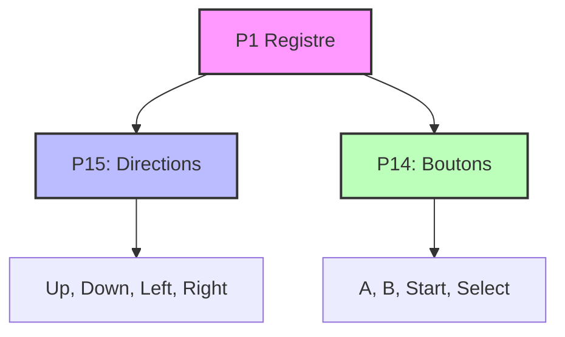

# Joypad – Spécifications d'implémentation

Retour: [Index specs](./README.md) · [Architecture](../architecture.md) · [Tests](../testing.md)

## Vue d'ensemble

Le joypad de la Game Boy gère les entrées utilisateur via un système de matrices de boutons. C'est un composant essentiel pour l'interaction avec les jeux.

### Pourquoi cette approche ?

La Game Boy utilise un système de matrices pour économiser les broches :
- **8 boutons** : 4 directions + 4 boutons d'action
- **2 lignes** : Sélection des groupes de boutons
- **1 registre** : P1 (0xFF00) pour tout gérer

## Structure du joypad

### Boutons disponibles
```c
typedef enum {
    JOYPAD_RIGHT  = 0x01,
    JOYPAD_LEFT   = 0x02,
    JOYPAD_UP     = 0x04,
    JOYPAD_DOWN   = 0x08,
    JOYPAD_A      = 0x01,
    JOYPAD_B      = 0x02,
    JOYPAD_SELECT = 0x04,
    JOYPAD_START  = 0x08
} JoypadButton;
```

**Pourquoi ces boutons ?** C'est le layout standard de la Game Boy :
- **D-pad** : 4 directions (haut, bas, gauche, droite)
- **Boutons d'action** : A, B, Start, Select

### Matrice de boutons


**Pourquoi une matrice ?** Économie de broches. Au lieu d'avoir 8 broches pour 8 boutons, on utilise 2 broches de sélection + 4 broches de lecture.

## Registre P1 (0xFF00)

### Structure du registre
```c
#define P1_REG 0xFF00

// Bits de sélection (écriture)
#define P1_SELECT_DIRECTIONS 0x20  // P15 = 0, P14 = 1
#define P1_SELECT_BUTTONS   0x10  // P15 = 1, P14 = 0
#define P1_SELECT_NONE      0x30  // P15 = 1, P14 = 1

// Bits de lecture (lecture)
#define P1_RIGHT  0x01
#define P1_LEFT   0x02
#define P1_UP     0x04
#define P1_DOWN   0x08
#define P1_A      0x01
#define P1_B      0x02
#define P1_SELECT 0x04
#define P1_START  0x08
```

**Pourquoi cette organisation ?** Les bits de sélection permettent de choisir quel groupe de boutons lire, les bits de lecture indiquent quels boutons sont pressés.

### Lecture du joypad
```c
u8 joypad_read(MMU* mmu) {
    u8 p1 = mmu_read8(mmu, P1_REG);
    u8 result = 0xFF;
    
    // Vérifier quelle ligne est sélectionnée
    if (!(p1 & P1_SELECT_DIRECTIONS)) {
        // Lire les directions
        result &= ~P1_RIGHT;  // 0 = pressé
        if (mmu->joypad->right) result |= P1_RIGHT;
        // ... autres directions
    }
    
    if (!(p1 & P1_SELECT_BUTTONS)) {
        // Lire les boutons
        result &= ~P1_A;  // 0 = pressé
        if (mmu->joypad->a) result |= P1_A;
        // ... autres boutons
    }
    
    return result;
}
```

**Pourquoi 0 = pressé ?** C'est le comportement matériel. Un bouton pressé court-circuite la ligne, donnant 0.

## Gestion des entrées

### État des boutons
```c
typedef struct {
    // État actuel des boutons
    bool right, left, up, down;
    bool a, b, start, select;
    
    // État précédent (pour détecter les changements)
    bool prev_right, prev_left, prev_up, prev_down;
    bool prev_a, prev_b, prev_start, prev_select;
    
    // Configuration
    bool irq_enabled;
    void (*irq_callback)(void* user_data);
    void* irq_user_data;
} Joypad;
```

**Pourquoi stocker l'état précédent ?** Pour détecter les transitions (appui/relâchement) et déclencher des événements.

### Mise à jour des boutons
```c
void joypad_update(Joypad* joypad, u8 button, bool pressed) {
    // Mettre à jour l'état précédent
    joypad->prev_right = joypad->right;
    joypad->prev_left = joypad->left;
    // ... autres boutons
    
    // Mettre à jour l'état actuel
    switch (button) {
        case JOYPAD_RIGHT:  joypad->right = pressed; break;
        case JOYPAD_LEFT:   joypad->left = pressed; break;
        case JOYPAD_UP:     joypad->up = pressed; break;
        case JOYPAD_DOWN:   joypad->down = pressed; break;
        case JOYPAD_A:      joypad->a = pressed; break;
        case JOYPAD_B:      joypad->b = pressed; break;
        case JOYPAD_START:  joypad->start = pressed; break;
        case JOYPAD_SELECT: joypad->select = pressed; break;
    }
    
    // Vérifier les changements
    joypad_check_changes(joypad);
}
```

**Pourquoi vérifier les changements ?** Pour déclencher des événements (interruptions, callbacks) seulement quand l'état change.

## Interruptions joypad

### Déclenchement d'interruption
```c
void joypad_check_changes(Joypad* joypad) {
    if (!joypad->irq_enabled) return;
    
    // Vérifier si un bouton a été pressé
    bool button_pressed = false;
    if (joypad->right && !joypad->prev_right) button_pressed = true;
    if (joypad->left && !joypad->prev_left) button_pressed = true;
    if (joypad->up && !joypad->prev_up) button_pressed = true;
    if (joypad->down && !joypad->prev_down) button_pressed = true;
    if (joypad->a && !joypad->prev_a) button_pressed = true;
    if (joypad->b && !joypad->prev_b) button_pressed = true;
    if (joypad->start && !joypad->prev_start) button_pressed = true;
    if (joypad->select && !joypad->prev_select) button_pressed = true;
    
    if (button_pressed && joypad->irq_callback) {
        joypad->irq_callback(joypad->irq_user_data);
    }
}
```

**Pourquoi seulement les appuis ?** C'est le comportement de la Game Boy. Les interruptions joypad se déclenchent seulement à l'appui, pas au relâchement.

### Configuration des interruptions
```c
void joypad_set_irq_callback(Joypad* joypad, void (*callback)(void*), void* user_data) {
    joypad->irq_callback = callback;
    joypad->irq_user_data = user_data;
}

void joypad_enable_irq(Joypad* joypad, bool enable) {
    joypad->irq_enabled = enable;
}
```

**Pourquoi un callback ?** Permet de découpler le joypad de la MMU. Le joypad peut signaler les changements sans connaître les détails de la MMU.

## Intégration avec la MMU

### Lecture depuis le CPU
```c
u8 mmu_read_joypad(MMU* mmu, u16 addr) {
    if (addr == P1_REG) {
        return joypad_read(mmu);
    }
    return 0xFF;
}
```

**Pourquoi passer par la MMU ?** Le CPU lit le joypad via le bus mémoire, pas directement.

### Écriture depuis le CPU
```c
void mmu_write_joypad(MMU* mmu, u16 addr, u8 value) {
    if (addr == P1_REG) {
        // L'écriture dans P1 ne change que les bits de sélection
        u8 current = mmu_read8(mmu, P1_REG);
        u8 new_value = (current & 0x0F) | (value & 0xF0);
        mmu_write8(mmu, P1_REG, new_value);
    }
}
```

**Pourquoi préserver les bits de lecture ?** Les bits de lecture sont contrôlés par l'état des boutons, pas par l'écriture.

## Gestion des entrées multiples

### Détection des combinaisons
```c
bool joypad_is_combination_pressed(Joypad* joypad, u8 buttons) {
    bool all_pressed = true;
    
    if (buttons & JOYPAD_RIGHT)  all_pressed &= joypad->right;
    if (buttons & JOYPAD_LEFT)   all_pressed &= joypad->left;
    if (buttons & JOYPAD_UP)     all_pressed &= joypad->up;
    if (buttons & JOYPAD_DOWN)   all_pressed &= joypad->down;
    if (buttons & JOYPAD_A)      all_pressed &= joypad->a;
    if (buttons & JOYPAD_B)      all_pressed &= joypad->b;
    if (buttons & JOYPAD_START)  all_pressed &= joypad->start;
    if (buttons & JOYPAD_SELECT) all_pressed &= joypad->select;
    
    return all_pressed;
}
```

**Pourquoi gérer les combinaisons ?** Certains jeux utilisent des combinaisons de boutons (ex: A+B pour sauvegarder).

### Anti-rebond
```c
void joypad_debounce(Joypad* joypad) {
    // Attendre quelques frames avant de considérer un changement valide
    static u8 debounce_counter = 0;
    
    if (debounce_counter > 0) {
        debounce_counter--;
        return;
    }
    
    // Vérifier les changements seulement si le debounce est terminé
    joypad_check_changes(joypad);
    
    if (joypad_has_changes(joypad)) {
        debounce_counter = 3;  // 3 frames de debounce
    }
}
```

**Pourquoi l'anti-rebond ?** Évite les appuis multiples accidentels dus aux vibrations mécaniques.

## Initialisation

```c
void joypad_init(Joypad* joypad) {
    memset(joypad, 0, sizeof(Joypad));
    
    // Valeurs de power-up
    joypad->right = false;
    joypad->left = false;
    joypad->up = false;
    joypad->down = false;
    joypad->a = false;
    joypad->b = false;
    joypad->start = false;
    joypad->select = false;
    
    joypad->irq_enabled = false;
    joypad->irq_callback = NULL;
    joypad->irq_user_data = NULL;
}
```

**Pourquoi ces valeurs ?** Tous les boutons sont relâchés au démarrage.

## Tests de conformité

### Test de lecture
```c
void test_joypad_read() {
    Joypad joypad;
    joypad_init(&joypad);
    
    // Simuler un appui sur A
    joypad.a = true;
    
    // Lire avec P1 configuré pour les boutons
    u8 p1 = P1_SELECT_BUTTONS;
    u8 result = joypad_read_with_p1(&joypad, p1);
    
    // A doit être à 0 (pressé)
    assert(!(result & P1_A));
}
```

**Pourquoi ces tests ?** Ils vérifient que le comportement du joypad est conforme aux spécifications.

## Références Pan Docs

- [Joypad Input](https://gbdev.io/pandocs/Joypad_Input.html)
