# Mémoire (Memory Map) – Spécifications d'implémentation

Retour: [Index specs](./README.md) · [Architecture](../architecture.md) · [Utilisation](../usage.md)

## Vue d'ensemble

La Game Boy utilise un système d'adressage 16-bit (0x0000-0xFFFF) pour accéder à différentes zones de mémoire. Chaque zone a un rôle spécifique et des contraintes d'accès particulières.

### Pourquoi cette organisation ?

La Game Boy a été conçue dans les années 1980 avec des contraintes de coût et de consommation. L'organisation mémoire reflète ces contraintes :
- **ROM** : Stockage permanent des jeux (coûteux, donc limité)
- **RAM** : Mémoire de travail (rapide mais limitée)
- **IO** : Communication avec les périphériques (écran, son, contrôles)
- **Miroirs** : Économie de circuits en réutilisant la même mémoire

## Carte mémoire (DMG)

```mermaid
flowchart TD
    A[0x0000-0x3FFF<br/>ROM0<br/>Banc 0 fixe]:::rom
    B[0x4000-0x7FFF<br/>ROMX<br/>Bancs commutables]:::rom
    C[0x8000-0x9FFF<br/>VRAM<br/>Données vidéo]:::vram
    D[0xA000-0xBFFF<br/>ERAM<br/>RAM externe]:::ram
    E[0xC000-0xDFFF<br/>WRAM<br/>RAM de travail]:::ram
    F[0xE000-0xFDFF<br/>Echo<br/>Miroir WRAM]:::echo
    G[0xFE00-0xFE9F<br/>OAM<br/>Sprites]:::oam
    H[0xFEA0-0xFEFF<br/>Unusable<br/>Zone interdite]:::bad
    I[0xFF00-0xFF7F<br/>IO<br/>Registres périphériques]:::io
    J[0xFF80-0xFFFE<br/>HRAM<br/>RAM haute vitesse]:::ram
    K[0xFFFF<br/>IE<br/>Masque interruptions]:::io

    classDef rom fill:#ffd,stroke:#aa0,stroke-width:2px
    classDef vram fill:#dfd,stroke:#0a0,stroke-width:2px
    classDef ram fill:#ddf,stroke:#00a,stroke-width:2px
    classDef echo fill:#eef,stroke:#88f,stroke-width:2px,stroke-dasharray:4 2
    classDef oam fill:#fdd,stroke:#a00,stroke-width:2px
    classDef io fill:#def,stroke:#06a,stroke-width:2px
    classDef bad fill:#eee,stroke:#999,stroke-width:2px,stroke-dasharray:2 2
```



## Zones détaillées

### ROM (0x0000-0x7FFF)
**Pourquoi deux zones ?** La Game Boy peut adresser 32KB de ROM, mais les jeux peuvent être plus gros. La zone ROM0 contient le code de démarrage, ROMX les données commutables.

- **ROM0 (0x0000-0x3FFF)** : Banc 0 fixe, contient le code de démarrage
- **ROMX (0x4000-0x7FFF)** : Bancs commutables via MBC (Memory Bank Controller)

**Implémentation :**
```c
// Dans mmu.c
u8 mmu_read_rom(MMU* mmu, u16 addr) {
    if (addr < 0x4000) {
        return mmu->rom[addr];  // ROM0
    } else {
        u16 bank = mmu->rom_bank;
        u16 offset = addr - 0x4000;
        return mmu->rom[0x4000 * bank + offset];  // ROMX
    }
}
```

### VRAM (0x8000-0x9FFF)
**Pourquoi séparé ?** La mémoire vidéo doit être accessible rapidement pendant le rendu, d'où une zone dédiée.

- **0x8000-0x97FF** : Données des tuiles (tile data)
- **0x9800-0x9BFF** : Carte d'arrière-plan 0 (tile map)
- **0x9C00-0x9FFF** : Carte d'arrière-plan 1 (tile map)

**Contraintes d'accès :** Pendant certains modes PPU, l'accès est restreint (voir section PPU).

### WRAM (0xC000-0xDFFF)
**Pourquoi cette taille ?** 8KB de RAM de travail, suffisant pour les variables et la pile.

- **0xC000-0xCFFF** : WRAM 0
- **0xD000-0xDFFF** : WRAM 1 (CGB uniquement)

### Echo RAM (0xE000-0xFDFF)
**Pourquoi un miroir ?** Économie de circuits. Au lieu d'avoir deux zones séparées, la Game Boy utilise le même circuit pour deux plages d'adresses.

```c
// Dans mmu.c
u8 mmu_read_wram(MMU* mmu, u16 addr) {
    if (addr >= 0xE000 && addr <= 0xFDFF) {
        // Echo : miroir de WRAM
        addr -= 0x2000;  // 0xE000 -> 0xC000
    }
    return mmu->wram[addr - 0xC000];
}
```

### OAM (0xFE00-0xFE9F)
**Pourquoi cette zone ?** Les sprites (objets) doivent être accessibles rapidement pendant le rendu.

- **160 octets** : 40 sprites × 4 octets par sprite
- **Structure** : Y, X, tile, attributs

### Zone Unusable (0xFEA0-0xFEFF)
**Pourquoi interdite ?** Cette zone n'a pas de circuit associé. Les lectures retournent 0xFF, les écritures sont ignorées.

```c
// Dans mmu.c
u8 mmu_read_unusable(u16 addr) {
    return 0xFF;  // Toujours 0xFF
}

void mmu_write_unusable(u16 addr, u8 value) {
    // Ignoré, pas d'effet
}
```

### Registres IO (0xFF00-0xFF7F)
**Pourquoi mappés en mémoire ?** Plus simple que des ports séparés. Chaque registre a un effet spécifique.

#### Registres principaux :
- **0xFF00 (P1)** : Joypad
- **0xFF04-0xFF07** : Timers (DIV, TIMA, TMA, TAC)
- **0xFF0F (IF)** : Drapeaux d'interruption
- **0xFF40-0xFF4B** : Contrôle LCD
- **0xFF47-0xFF49** : Palettes de couleurs
- **0xFF50** : Boot ROM disable

### HRAM (0xFF80-0xFFFE)
**Pourquoi une zone séparée ?** Accès plus rapide que WRAM, idéal pour les variables critiques.

### IE (0xFFFF)
**Pourquoi le dernier octet ?** Le registre d'interruption doit être accessible rapidement, d'où sa position à la fin de l'espace d'adressage.

## Gestion des accès

### Lecture/Écriture 8-bit
```c
u8 mmu_read8(MMU* mmu, u16 addr) {
    if (addr < 0x8000) {
        return mmu_read_rom(mmu, addr);
    } else if (addr < 0xA000) {
        return mmu_read_vram(mmu, addr);
    } else if (addr < 0xC000) {
        return mmu_read_eram(mmu, addr);
    } else if (addr < 0xFE00) {
        return mmu_read_wram(mmu, addr);
    } else if (addr < 0xFEA0) {
        return mmu_read_oam(mmu, addr);
    } else if (addr < 0xFF00) {
        return mmu_read_unusable(addr);
    } else if (addr < 0xFF80) {
        return mmu_read_io(mmu, addr);
    } else if (addr < 0xFFFF) {
        return mmu_read_hram(mmu, addr);
    } else {
        return mmu->ie;  // 0xFFFF
    }
}
```

### Lecture/Écriture 16-bit
**Pourquoi little-endian ?** La Game Boy utilise le format little-endian (octet de poids faible en premier).

```c
u16 mmu_read16(MMU* mmu, u16 addr) {
    u8 low = mmu_read8(mmu, addr);
    u8 high = mmu_read8(mmu, addr + 1);
    return (high << 8) | low;  // Little-endian
}

void mmu_write16(MMU* mmu, u16 addr, u16 value) {
    mmu_write8(mmu, addr, value & 0xFF);        // Octet faible
    mmu_write8(mmu, addr + 1, (value >> 8) & 0xFF);  // Octet fort
}
```

## Contraintes d'accès

### Accès VRAM/OAM pendant le rendu
**Pourquoi des restrictions ?** Le PPU lit ces zones pendant le rendu. Les accès simultanés peuvent causer des corruptions.

```c
// Dans mmu.c
bool mmu_can_access_vram(PPU* ppu) {
    return ppu->mode == PPU_MODE_HBLANK || ppu->mode == PPU_MODE_VBLANK;
}

bool mmu_can_access_oam(PPU* ppu) {
    return ppu->mode == PPU_MODE_HBLANK || ppu->mode == PPU_MODE_VBLANK;
}
```

### DMA OAM
**Pourquoi un transfert spécial ?** Le DMA copie 160 octets depuis WRAM vers OAM en 160 cycles, bloquant l'accès à OAM pendant le transfert.

## Initialisation (Power-up)

**Pourquoi des valeurs spécifiques ?** La Game Boy n'initialise pas tout à zéro au démarrage. Certaines valeurs sont importantes pour la compatibilité.

```c
// Dans mmu.c
void mmu_init(MMU* mmu) {
    // WRAM initialisé à 0xFF (pas 0x00)
    memset(mmu->wram, 0xFF, sizeof(mmu->wram));
    
    // Registres IO avec valeurs de power-up
    mmu->io[0xFF00 - 0xFF00] = 0xCF;  // P1
    mmu->io[0xFF04 - 0xFF00] = 0xAB;  // DIV
    mmu->io[0xFF05 - 0xFF00] = 0x00;  // TIMA
    mmu->io[0xFF06 - 0xFF00] = 0x00;  // TMA
    mmu->io[0xFF07 - 0xFF00] = 0xF8;  // TAC
    // ... autres registres
}
```

## Références Pan Docs

- [Memory Map](https://gbdev.io/pandocs/Memory_Map.html)
- [I/O Ports](https://gbdev.io/pandocs/I_O_Ports.html)
- [Accessing VRAM and OAM](https://gbdev.io/pandocs/Accessing_VRAM_and_OAM.html)
- [OAM DMA Transfer](https://gbdev.io/pandocs/OAM_DMA_Transfer.html)
