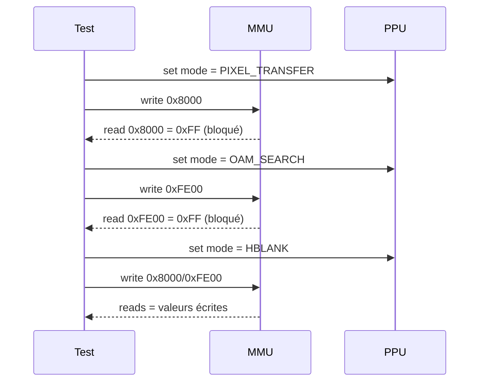

```mermaid
flowchart TD
    A[0x0000-0x3FFF<br/>ROM0<br/>Banc 0 fixe]:::rom
    B[0x4000-0x7FFF<br/>ROMX<br/>Bancs commutables]:::rom
    C[0x8000-0x9FFF<br/>VRAM<br/>Données vidéo]:::vram
    D[0xA000-0xBFFF<br/>ERAM<br/>RAM externe]:::ram
    E[0xC000-0xDFFF<br/>WRAM<br/>RAM de travail]:::ram
    F[0xE000-0xFDFF<br/>Echo<br/>Miroir WRAM]:::echo
    G[0xFE00-0xFE9F<br/>OAM<br/>Sprites]:::oam
    H[0xFEA0-0xFEFF<br/>Unusable<br/>Zone interdite]:::bad
    I[0xFF00-0xFF7F<br/>IO<br/>Registres périphériques]:::io
    J[0xFF80-0xFFFE<br/>HRAM<br/>RAM haute vitesse]:::ram
    K[0xFFFF<br/>IE<br/>Masque interruptions]:::io

    classDef rom fill:#ffd,stroke:#aa0,stroke-width:2px
    classDef vram fill:#dfd,stroke:#0a0,stroke-width:2px
    classDef ram fill:#ddf,stroke:#00a,stroke-width:2px
    classDef echo fill:#eef,stroke:#88f,stroke-width:2px,stroke-dasharray:4 2
    classDef oam fill:#fdd,stroke:#a00,stroke-width:2px
    classDef io fill:#def,stroke:#06a,stroke-width:2px
    classDef bad fill:#eee,stroke:#999,stroke-width:2px,stroke-dasharray:2 2
```

# Mémoire (Memory Map) – Spécifications d'implémentation

Retour: [Index specs](./README.md) · [Architecture](../architecture.md) · [Utilisation](../usage.md)

## 1) Principe de fonctionnement (Game Boy)

La Game Boy utilise un adressage 16-bit (0x0000–0xFFFF) découpé en zones. Certaines zones sont restreintes selon l’état vidéo (PPU) et des opérations spéciales (DMA OAM).

### Carte mémoire (DMG)

- Echo RAM (0xE000–0xFDFF) miroite WRAM (0xC000–0xDDFF)
- Zone 0xFEA0–0xFEFF inutilisable (lectures=0xFF, écritures ignorées)

### Restrictions d’accès VRAM/OAM (timing PPU)

- Mode 3 (Pixel Transfer): VRAM bloquée
- Modes 2 (OAM Search) et 3: OAM bloquée
- Pendant un DMA OAM: OAM bloquée

```mermaid
gantt
  title Restrictions d'accès VRAM/OAM (par ligne)
  dateFormat X
  axisFormat %s
  section Modes visibles
  OAM Search (2): done, 0, 80
  Pixel Transfer (3): done, 80, 172
  HBlank (0): 204, 204
  section VBlank
  VBlank (1): 456, 456
```

### OAM DMA (0xFF46)

- Écrire `val` à `0xFF46` copie 160 octets depuis `(val << 8)` vers OAM (0xFE00–0xFE9F)
- Vitesse matérielle: 1 octet/cycle (nous offrons une version synchrone simple)

### Pourquoi ces règles ? (non-expert)
- Le PPU a besoin d’un accès prioritaire à VRAM/OAM pendant le dessin de l’image; bloquer les accès CPU évite les corruptions
- Le DMA OAM accélère la mise à jour des sprites (copie d’un bloc)

Réfs Pan Docs: Memory Map, Accessing VRAM and OAM, OAM DMA Transfer

---

## 2) Logique d’implémentation (CameBoy)

### Structure et liaisons
- `MMU` stocke des pointeurs sur les régions (`rom`, `vram`, `eram`, `wram`, `oam`, `io`, `hram`) et sur les composants (`timer`, `apu`, `joypad`, `ppu`)
- Ajout `mmu_set_ppu(mmu, ppu)` pour connaître le `PPU->mode`
- État DMA: `mmu->dma { active, source_addr, index }`

### Accès mémoire (règles clés)
- `mmu_read8/write8`:
  - ROM/ERAM: routés via `mbc_read/mbc_write` (MBC1 minimal)
  - VRAM: lecture/écriture bloquées en Mode 3 (retour 0xFF / ignore write)
  - OAM: lecture/écriture bloquées en Modes 2/3 et pendant DMA
  - Echo RAM: miroir WRAM
  - IO:
    - Joypad `0xFF00` routé via `joypad_read/write`
    - Timers `0xFF04–0xFF07` routés vers `timer_read/write`
    - Audio `0xFF10–0xFF3F` routés vers `apu_read/write`
    - OAM DMA `0xFF46`: déclenche la copie OAM (synchrone)
  - HRAM/IE: accès directs

### OAM DMA (implémentation actuelle)
- Version simple synchrone: boucle 160 octets, `mmu->oam[i] = mmu_read8(mmu, src+i)`
- Drapeau `dma.active` remis à `false` immédiatement après la copie
- Option future: version timée (1 octet par tick) si nécessaire pour des ROMs Mooneye

### VRAM/OAM restrictions
- Fonctions utilitaires dans `mmu.c`:
  - `mmu_vram_access_allowed(mmu)`: refuse en Mode 3
  - `mmu_oam_access_allowed(mmu)`: refuse en Mode 2/3 ou DMA actif

### MBC
- MBC1 minimal suffisant pour Blargg de base (ROM banking, RAM enable/bank, mode)
- MBC3/MBC5 à venir

### Points assumés/paramétrés
- `LY` reset à `0x90` (compat Blargg); un mode strict Pan Docs (0x00) pourra être ajouté si besoin
- Série (SB/SC): transfert immédiat pour logs/GUI; temporisation série non implémentée (piste future)

---

## 3) Stratégie de test (unitaires)

Tests dans `tests/unit/test_mmu.c` (liste et objectifs):

- `test_mmu_init`
  - Alloue 64KB, vérifie les pointeurs des régions
- `test_mmu_reset`
  - Vérifie les valeurs IO de power-up (P1, LCDC, STAT, LY, etc.)
- `test_mmu_memory_mapping`
  - Lecture des bornes de chaque zone et d’IE
- `test_mmu_cart_parsing`
  - Parse un header ROM mémoire et vérifie type/tailles
- `test_mmu_read_write_8bit`
  - Écritures/lectures basiques WRAM/VRAM/OAM/HRAM/IE
- `test_mmu_read_write_16bit`
  - Little-endian: vérifie LSB/MSB, HRAM 16-bit
- `test_mmu_echo_ram`
  - Miroir WRAM⇄Echo: écritures répercutées
- `test_mmu_vram_oam_restrictions` (nouveau)
  - Lie `PPU` à `MMU`, force Mode 3 (VRAM bloquée) et Mode 2 (OAM bloquée); vérifie 0xFF/ignorés; vérifie accès libres en HBlank
- `test_mmu_dma_oam_copy` (nouveau)
  - Prépare source WRAM `0xC000`, écrit `0xFF46=0xC0`, vérifie que 160 octets ont été recopiés vers OAM

### Couverture et limites
- Couvre mapping, power-up, echo, restrictions VRAM/OAM, DMA OAM
- Série cadencée et MBC3/5 non couverts (pistes futures)

---

## Références Pan Docs
- [Memory Map](https://gbdev.io/pandocs/Memory_Map.html)
- [I/O Ports](https://gbdev.io/pandocs/I_O_Ports.html)
- [Accessing VRAM and OAM](https://gbdev.io/pandocs/Accessing_VRAM_and_OAM.html)
- [OAM DMA Transfer](https://gbdev.io/pandocs/OAM_DMA_Transfer.html)
