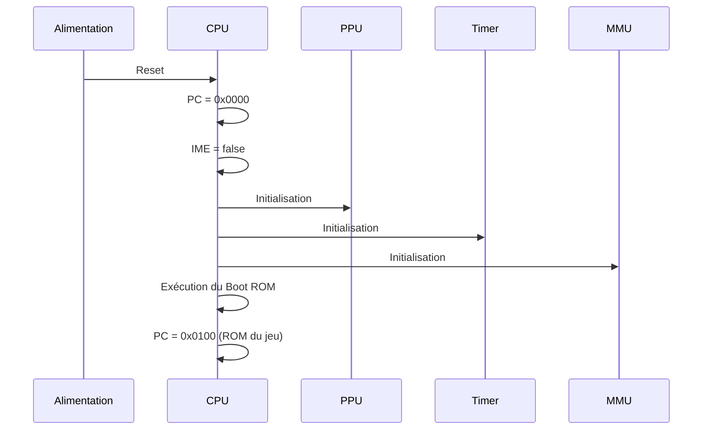

# Séquence de démarrage – Spécifications d'implémentation

Retour: [Index specs](./README.md) · [Architecture](../architecture.md) · [Utilisation](../usage.md)

## Vue d'ensemble

La séquence de démarrage (power-up) de la Game Boy initialise tous les composants avec des valeurs spécifiques. Cette initialisation est cruciale pour la compatibilité des jeux.

### Pourquoi une séquence spécifique ?

La Game Boy a un comportement de démarrage précis :
- **Valeurs initiales** : Chaque registre a une valeur spécifique
- **Timing** : L'ordre d'initialisation est important
- **Compatibilité** : Les jeux s'appuient sur ces valeurs
- **Stabilité** : Évite les états indéterminés

## Séquence de démarrage

### Étapes du démarrage


**Pourquoi cette séquence ?** L'ordre d'initialisation est important pour éviter les conflits entre composants.

### Boot ROM
```c
// Le Boot ROM est exécuté en premier (0x0000-0x00FF)
void boot_rom_execute(CPU* cpu, MMU* mmu) {
    // Le Boot ROM vérifie l'intégrité de la cartouche
    // et affiche le logo Nintendo
    
    // À la fin, il saute à 0x0100 (début de la ROM du jeu)
    cpu->pc = 0x0100;
}
```

**Pourquoi un Boot ROM ?** Il vérifie l'intégrité de la cartouche et affiche le logo Nintendo avant de lancer le jeu.

## Initialisation du CPU

### Registres CPU
```c
void cpu_power_up(CPU* cpu) {
    // Valeurs exactes de power-up
    cpu->a = 0x01;
    cpu->f = 0xB0;  // Flags Z=1, N=0, H=1, C=0
    cpu->b = 0x00;
    cpu->c = 0x13;
    cpu->d = 0x00;
    cpu->e = 0xD8;
    cpu->h = 0x01;
    cpu->l = 0x4D;
    cpu->sp = 0xFFFE;
    cpu->pc = 0x0000;  // Démarre au Boot ROM
    
    // État des interruptions
    cpu->ime = false;  // Interruptions désactivées
    cpu->halted = false;
    cpu->halt_bug = false;
}
```

**Pourquoi ces valeurs ?** Ce sont les valeurs exactes de la Game Boy au démarrage, importantes pour la compatibilité.

### Flags CPU
```c
// Valeurs des flags au démarrage
#define POWER_UP_FLAGS 0xB0  // 10110000

// Détail des flags
#define FLAG_Z 0x80  // 1 (zéro)
#define FLAG_N 0x40  // 0 (pas de soustraction)
#define FLAG_H 0x20  // 1 (demi-retient)
#define FLAG_C 0x10  // 0 (pas de retient)
```

**Pourquoi ces flags ?** Ils reflètent l'état du CPU après l'initialisation matérielle.

## Initialisation du PPU

### Registres PPU
```c
void ppu_power_up(PPU* ppu) {
    // Valeurs exactes de power-up
    ppu->lcdc = 0x91;  // LCD activé, BG activé
    ppu->stat = 0x85;  // Mode VBlank
    ppu->scy = 0x00;   // Scroll Y
    ppu->scx = 0x00;   // Scroll X
    ppu->ly = 0x00;    // Ligne courante
    ppu->lyc = 0x00;   // LYC
    ppu->bgp = 0xFC;   // Palette BG
    ppu->obp0 = 0xFF;  // Palette OBJ 0
    ppu->obp1 = 0xFF;  // Palette OBJ 1
    ppu->wy = 0x00;    // Window Y
    ppu->wx = 0x00;    // Window X
    
    // État interne
    ppu->mode = PPU_MODE_HBLANK;
    ppu->mode_cycles = 0;
    ppu->line_cycles = 0;
}
```

**Pourquoi ces valeurs ?** Elles correspondent à l'état du PPU après l'initialisation matérielle.

### Mode PPU initial
```c
// Le PPU démarre en mode HBlank
ppu->mode = PPU_MODE_HBLANK;
ppu->ly = 0x00;  // Ligne 0
```

**Pourquoi HBlank ?** C'est le mode le plus sûr pour l'initialisation, sans conflits d'accès.

## Initialisation des timers

### Registres Timer
```c
void timer_power_up(Timer* timer) {
    // Valeurs exactes de power-up
    timer->div = 0xAB;    // DIV commence à 0xAB
    timer->tima = 0x00;   // TIMA commence à 0x00
    timer->tma = 0x00;    // TMA commence à 0x00
    timer->tac = 0xF8;    // TAC commence à 0xF8 (timer désactivé)
    
    // État interne
    timer->div_cycles = 0;
    timer->tima_cycles = 0;
    timer->overflow = false;
}
```

**Pourquoi ces valeurs ?** Elles reflètent l'état des timers après l'initialisation matérielle.

### DIV initial
```c
// DIV commence à 0xAB, pas 0x00
timer->div = 0xAB;
```

**Pourquoi 0xAB ?** C'est la valeur exacte de DIV au démarrage, importante pour la synchronisation.

## Initialisation de la MMU

### Registres IO
```c
void mmu_power_up(MMU* mmu) {
    // Valeurs exactes de power-up
    mmu->io[0xFF00 - 0xFF00] = 0xCF;  // P1 (joypad)
    mmu->io[0xFF01 - 0xFF00] = 0x00;  // SB (série)
    mmu->io[0xFF02 - 0xFF00] = 0x7E;  // SC (série)
    mmu->io[0xFF04 - 0xFF00] = 0xAB;  // DIV
    mmu->io[0xFF05 - 0xFF00] = 0x00;  // TIMA
    mmu->io[0xFF06 - 0xFF00] = 0x00;  // TMA
    mmu->io[0xFF07 - 0xFF00] = 0xF8;  // TAC
    mmu->io[0xFF0F - 0xFF00] = 0xE1;  // IF (bits 5-7 toujours 1)
    mmu->io[0xFF40 - 0xFF00] = 0x91;  // LCDC
    mmu->io[0xFF41 - 0xFF00] = 0x85;  // STAT
    mmu->io[0xFF42 - 0xFF00] = 0x00;  // SCY
    mmu->io[0xFF43 - 0xFF00] = 0x00;  // SCX
    mmu->io[0xFF44 - 0xFF00] = 0x00;  // LY
    mmu->io[0xFF45 - 0xFF00] = 0x00;  // LYC
    mmu->io[0xFF46 - 0xFF00] = 0x00;  // DMA
    mmu->io[0xFF47 - 0xFF00] = 0xFC;  // BGP
    mmu->io[0xFF48 - 0xFF00] = 0xFF;  // OBP0
    mmu->io[0xFF49 - 0xFF00] = 0xFF;  // OBP1
    mmu->io[0xFF4A - 0xFF00] = 0x00;  // WY
    mmu->io[0xFF4B - 0xFF00] = 0x00;  // WX
    mmu->io[0xFFFF - 0xFF00] = 0x00;  // IE (toutes interruptions désactivées)
}
```

**Pourquoi ces valeurs ?** Ce sont les valeurs exactes des registres IO au démarrage.

### Mémoire
```c
void mmu_power_up_memory(MMU* mmu) {
    // WRAM initialisé à 0xFF (pas 0x00)
    memset(mmu->wram, 0xFF, sizeof(mmu->wram));
    
    // VRAM initialisé à 0x00
    memset(mmu->vram, 0x00, sizeof(mmu->vram));
    
    // OAM initialisé à 0x00
    memset(mmu->oam, 0x00, sizeof(mmu->oam));
    
    // HRAM initialisé à 0x00
    memset(mmu->hram, 0x00, sizeof(mmu->hram));
}
```

**Pourquoi 0xFF pour WRAM ?** C'est le comportement matériel. La WRAM est initialisée à 0xFF, pas 0x00.

## Initialisation du joypad

### État du joypad
```c
void joypad_power_up(Joypad* joypad) {
    // Tous les boutons sont relâchés au démarrage
    joypad->right = false;
    joypad->left = false;
    joypad->up = false;
    joypad->down = false;
    joypad->a = false;
    joypad->b = false;
    joypad->start = false;
    joypad->select = false;
    
    // Interruptions désactivées
    joypad->irq_enabled = false;
    joypad->irq_callback = NULL;
    joypad->irq_user_data = NULL;
}
```

**Pourquoi tous relâchés ?** C'est l'état naturel des boutons au démarrage.

## Séquence complète

### Fonction d'initialisation
```c
void emulator_power_up(Emulator* emu) {
    // Initialiser tous les composants
    cpu_power_up(&emu->cpu);
    ppu_power_up(&emu->ppu);
    timer_power_up(&emu->timer);
    mmu_power_up(&emu->mmu);
    joypad_power_up(&emu->joypad);
    
    // Charger le Boot ROM
    mmu_load_boot_rom(&emu->mmu);
    
    // Démarrer l'exécution
    emu->running = true;
    emu->cpu.pc = 0x0000;  // Démarre au Boot ROM
}
```

**Pourquoi cette séquence ?** L'ordre d'initialisation est important pour éviter les conflits.

### Boot ROM
```c
void mmu_load_boot_rom(MMU* mmu) {
    // Le Boot ROM est chargé dans la zone 0x0000-0x00FF
    // Il vérifie l'intégrité de la cartouche et affiche le logo Nintendo
    
    // À la fin, il saute à 0x0100 (début de la ROM du jeu)
    // et désactive l'accès au Boot ROM
}
```

**Pourquoi un Boot ROM ?** Il fournit une séquence de démarrage standardisée et vérifie l'intégrité de la cartouche.

## Tests de conformité

### Test des valeurs de power-up
```c
void test_power_up_values() {
    Emulator emu;
    emulator_power_up(&emu);
    
    // Vérifier les valeurs CPU
    assert(emu.cpu.a == 0x01);
    assert(emu.cpu.f == 0xB0);
    assert(emu.cpu.sp == 0xFFFE);
    assert(emu.cpu.pc == 0x0000);
    
    // Vérifier les valeurs PPU
    assert(emu.ppu.lcdc == 0x91);
    assert(emu.ppu.stat == 0x85);
    assert(emu.ppu.ly == 0x00);
    
    // Vérifier les valeurs Timer
    assert(emu.timer.div == 0xAB);
    assert(emu.timer.tima == 0x00);
    assert(emu.timer.tac == 0xF8);
}
```

**Pourquoi ces tests ?** Ils vérifient que l'initialisation respecte les valeurs exactes de la Game Boy.

## Références Pan Docs

- [Power-Up Sequence](https://gbdev.io/pandocs/Power_Up_Sequence.html)
