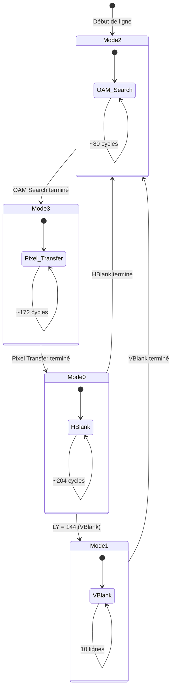
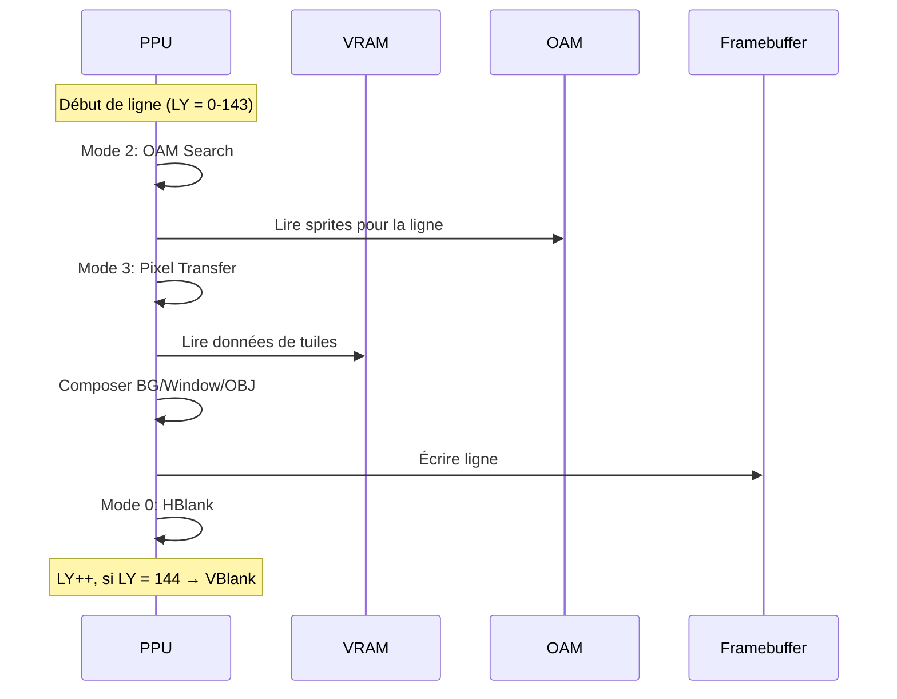

# PPU (Picture Processing Unit) – Spécifications d'implémentation

Retour: [Index specs](./README.md) · [Architecture](../architecture.md) · [Utilisation](../usage.md)

## Vue d'ensemble

Le PPU (Picture Processing Unit) est le moteur vidéo de la Game Boy. Il génère l'image 160×144 pixels en temps réel, ligne par ligne, en respectant des contraintes de timing strictes.

### Pourquoi cette approche ?

La Game Boy utilise un système de rendu en temps réel pour économiser la mémoire :
- **Pas de framebuffer complet** : L'image est générée ligne par ligne
- **Timing strict** : 456 cycles par ligne, 144 lignes visibles
- **Accès restreints** : Certaines zones mémoire sont inaccessibles pendant le rendu

## Modes de fonctionnement

### Les 4 modes PPU


**Pourquoi ces modes ?** Chaque mode correspond à une phase du rendu :
- **Mode 2 (OAM Search)** : Recherche des sprites pour la ligne courante
- **Mode 3 (Pixel Transfer)** : Lecture des données et génération des pixels
- **Mode 0 (HBlank)** : Pause entre les lignes
- **Mode 1 (VBlank)** : Pause entre les frames

### Timing des modes
```c
#define CYCLES_PER_LINE 456
#define VISIBLE_LINES 144
#define VBLANK_LINES 10
#define TOTAL_LINES (VISIBLE_LINES + VBLANK_LINES)

typedef enum {
    PPU_MODE_HBLANK = 0,
    PPU_MODE_VBLANK = 1,
    PPU_MODE_OAM_SEARCH = 2,
    PPU_MODE_PIXEL_TRANSFER = 3
} PPUMode;
```

**Pourquoi 456 cycles par ligne ?** C'est la fréquence du PPU (4.194304 MHz) divisée par la fréquence de balayage horizontal.

## Registres de contrôle

### LCDC (0xFF40) - LCD Control
```c
#define LCDC_BG_ENABLE    0x01  // Arrière-plan activé
#define LCDC_OBJ_ENABLE   0x02  // Sprites activés
#define LCDC_OBJ_SIZE     0x04  // Taille des sprites (8x8 ou 8x16)
#define LCDC_BG_MAP       0x08  // Carte d'arrière-plan (0x9800 ou 0x9C00)
#define LCDC_BG_DATA      0x10  // Données d'arrière-plan (0x8000 ou 0x8800)
#define LCDC_WINDOW_ENABLE 0x20 // Fenêtre activée
#define LCDC_WINDOW_MAP   0x40  // Carte de fenêtre (0x9800 ou 0x9C00)
#define LCDC_LCD_ENABLE   0x80  // LCD activé
```

**Pourquoi ces bits ?** Chaque bit contrôle un aspect du rendu :
- **BG_ENABLE** : Affiche l'arrière-plan
- **OBJ_ENABLE** : Affiche les sprites
- **OBJ_SIZE** : 8x8 ou 8x16 pixels par sprite
- **BG_MAP** : Quelle carte utiliser pour l'arrière-plan
- **BG_DATA** : Quelle zone de données utiliser
- **WINDOW_ENABLE** : Affiche la fenêtre (overlay)
- **LCD_ENABLE** : Active/désactive l'écran

### STAT (0xFF41) - LCD Status
```c
#define STAT_MODE_MASK    0x03  // Mode PPU (0-3)
#define STAT_LYC_FLAG     0x04  // LY = LYC
#define STAT_HBLANK_IRQ   0x08  // IRQ en HBlank
#define STAT_VBLANK_IRQ   0x10  // IRQ en VBlank
#define STAT_OAM_IRQ      0x20  // IRQ en OAM Search
#define STAT_LYC_IRQ      0x40  // IRQ quand LY = LYC
```

**Pourquoi ces bits ?** Ils indiquent l'état du PPU et permettent de générer des interruptions :
- **MODE_MASK** : Mode actuel (0-3)
- **LYC_FLAG** : LY égal à LYC
- **HBLANK_IRQ** : Interruption en HBlank
- **VBLANK_IRQ** : Interruption en VBlank
- **OAM_IRQ** : Interruption en OAM Search
- **LYC_IRQ** : Interruption quand LY = LYC

## Rendu ligne par ligne

### Séquence de rendu


### Mode 2 : OAM Search
```c
void ppu_oam_search(PPU* ppu, u8* oam) {
    ppu->sprite_count = 0;
    
    for (int i = 0; i < 40 && ppu->sprite_count < 10; i++) {
        u8 y = oam[i * 4 + 0];
        u8 x = oam[i * 4 + 1];
        u8 tile = oam[i * 4 + 2];
        u8 flags = oam[i * 4 + 3];
        
        // Vérifier si le sprite est sur la ligne courante
        if (y > 0 && y < 168 && ppu->ly >= y - 16 && ppu->ly < y - 8) {
            ppu->sprites[ppu->sprite_count] = (Sprite){x, y, tile, flags};
            ppu->sprite_count++;
        }
    }
}
```

**Pourquoi limiter à 10 sprites ?** Limitation matérielle. Plus de sprites causeraient des problèmes de timing.

### Mode 3 : Pixel Transfer
```c
void ppu_pixel_transfer(PPU* ppu, u8* vram) {
    // Rendu de l'arrière-plan
    if (ppu->lcdc & LCDC_BG_ENABLE) {
        ppu_render_background(ppu, vram);
    }
    
    // Rendu de la fenêtre
    if (ppu->lcdc & LCDC_WINDOW_ENABLE) {
        ppu_render_window(ppu, vram);
    }
    
    // Rendu des sprites
    if (ppu->lcdc & LCDC_OBJ_ENABLE) {
        ppu_render_sprites(ppu, vram);
    }
}
```

**Pourquoi cette séquence ?** L'ordre de rendu détermine la priorité des couches :
1. Arrière-plan (fond)
2. Fenêtre (overlay)
3. Sprites (devant)

## Données graphiques

### Tuiles (Tile Data)
```c
// Chaque tuile fait 8x8 pixels, 16 octets par tuile
void ppu_render_tile(PPU* ppu, u8* vram, u16 tile_addr, u16 map_addr, int x, int y) {
    u8 tile_id = vram[map_addr - 0x8000];
    u16 tile_data_addr = tile_addr + (tile_id * 16);
    
    for (int py = 0; py < 8; py++) {
        u8 byte1 = vram[tile_data_addr + py * 2];
        u8 byte2 = vram[tile_data_addr + py * 2 + 1];
        
        for (int px = 0; px < 8; px++) {
            u8 pixel = ((byte2 >> (7 - px)) & 1) << 1 | ((byte1 >> (7 - px)) & 1);
            ppu->framebuffer[(y + py) * 160 + (x + px)] = pixel;
        }
    }
}
```

**Pourquoi 16 octets par tuile ?** Chaque pixel fait 2 bits (4 couleurs), donc 8×8×2 = 128 bits = 16 octets.

### Palettes de couleurs
```c
// BGP (0xFF47) - Palette d'arrière-plan
u8 ppu_get_bg_color(PPU* ppu, u8 pixel) {
    u8 palette = ppu->bgp;
    u8 color_index = (palette >> (pixel * 2)) & 0x03;
    return ppu->colors[color_index];
}

// OBP0/OBP1 (0xFF48/0xFF49) - Palettes de sprites
u8 ppu_get_sprite_color(PPU* ppu, u8 pixel, u8 palette) {
    u8 pal_reg = (palette == 0) ? ppu->obp0 : ppu->obp1;
    u8 color_index = (pal_reg >> (pixel * 2)) & 0x03;
    return ppu->colors[color_index];
}
```

**Pourquoi des palettes ?** Économie de mémoire. Au lieu de stocker 4 couleurs par pixel, on stocke un index dans une palette.

## Gestion des interruptions

### Interruptions PPU
```c
void ppu_check_interrupts(PPU* ppu, MMU* mmu) {
    u8 stat = mmu_read8(mmu, 0xFF41);
    u8 ly = mmu_read8(mmu, 0xFF44);
    u8 lyc = mmu_read8(mmu, 0xFF45);
    
    // Mettre à jour le mode dans STAT
    stat = (stat & ~STAT_MODE_MASK) | ppu->mode;
    
    // Vérifier LY = LYC
    if (ly == lyc) {
        stat |= STAT_LYC_FLAG;
        if (stat & STAT_LYC_IRQ) {
            mmu_request_interrupt(mmu, IRQ_LCD);
        }
    } else {
        stat &= ~STAT_LYC_FLAG;
    }
    
    // Vérifier les interruptions de mode
    if (ppu->mode == PPU_MODE_HBLANK && (stat & STAT_HBLANK_IRQ)) {
        mmu_request_interrupt(mmu, IRQ_LCD);
    }
    if (ppu->mode == PPU_MODE_VBLANK && (stat & STAT_VBLANK_IRQ)) {
        mmu_request_interrupt(mmu, IRQ_VBLANK);
    }
    if (ppu->mode == PPU_MODE_OAM_SEARCH && (stat & STAT_OAM_IRQ)) {
        mmu_request_interrupt(mmu, IRQ_LCD);
    }
    
    mmu_write8(mmu, 0xFF41, stat);
}
```

**Pourquoi ces interruptions ?** Elles permettent aux jeux de synchroniser avec le rendu :
- **VBlank** : Fin de frame, temps pour mettre à jour l'écran
- **HBlank** : Fin de ligne, temps pour des effets spéciaux
- **OAM** : Début de ligne, temps pour modifier les sprites
- **LYC** : Ligne spécifique, pour des effets de scanline

## Accès restreints

### Restrictions d'accès
```c
bool ppu_can_access_vram(PPU* ppu) {
    return ppu->mode == PPU_MODE_HBLANK || ppu->mode == PPU_MODE_VBLANK;
}

bool ppu_can_access_oam(PPU* ppu) {
    return ppu->mode == PPU_MODE_HBLANK || ppu->mode == PPU_MODE_VBLANK;
}
```

**Pourquoi ces restrictions ?** Le PPU lit ces zones pendant le rendu. Les accès simultanés peuvent causer des corruptions ou des glitches.

### Gestion des accès
```c
u8 mmu_read_vram(MMU* mmu, u16 addr) {
    if (!ppu_can_access_vram(&mmu->ppu)) {
        return 0xFF;  // Valeur par défaut
    }
    return mmu->vram[addr - 0x8000];
}

void mmu_write_vram(MMU* mmu, u16 addr, u8 value) {
    if (!ppu_can_access_vram(&mmu->ppu)) {
        return;  // Ignoré
    }
    mmu->vram[addr - 0x8000] = value;
}
```

## Initialisation

```c
void ppu_init(PPU* ppu) {
    memset(ppu, 0, sizeof(PPU));
    
    // Valeurs de power-up
    ppu->lcdc = 0x91;  // LCD activé, BG activé
    ppu->stat = 0x85;  // Mode VBlank
    ppu->scy = 0x00;   // Scroll Y
    ppu->scx = 0x00;   // Scroll X
    ppu->ly = 0x00;    // Ligne courante
    ppu->lyc = 0x00;   // LYC
    ppu->bgp = 0xFC;   // Palette BG
    ppu->obp0 = 0xFF;  // Palette OBJ 0
    ppu->obp1 = 0xFF;  // Palette OBJ 1
    ppu->wy = 0x00;    // Window Y
    ppu->wx = 0x00;    // Window X
    
    ppu->mode = PPU_MODE_HBLANK;
    ppu->mode_cycles = 0;
    ppu->line_cycles = 0;
}
```

**Pourquoi ces valeurs ?** Ce sont les valeurs exactes de la Game Boy au démarrage, importantes pour la compatibilité.

## Références Pan Docs

- [Graphics](https://gbdev.io/pandocs/Graphics.html)
- [LCD Control](https://gbdev.io/pandocs/LCD_Control.html)
- [LCD Status Registers](https://gbdev.io/pandocs/LCD_Status_Registers.html)
- [Rendering](https://gbdev.io/pandocs/Rendering.html)
