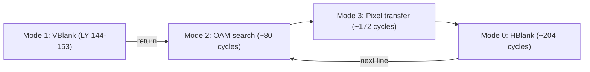

# PPU (Picture Processing Unit) – Spécifications d'implémentation

Retour: [Index specs](./README.md) · [Architecture](../architecture.md) · [Utilisation](../usage.md)

## 1) Principe de fonctionnement (Game Boy)

Le PPU génère l’image 160×144, ligne par ligne, avec un timing strict.
- 456 cycles par ligne (aussi appelés « dots »: 1 dot = 1 cycle PPU ≈ 1 cycle CPU)
- 144 lignes visibles (LY 0–143), puis ~10 lignes de VBlank (LY 144–153)
- Par ligne visible: Mode 2 (OAM Search) → Mode 3 (Pixel Transfer) → Mode 0 (HBlank)
- À l’entrée de LY=144: Mode 1 (VBlank) + IRQ VBlank

Jargon (clarifié):
- OAM: Object Attribute Memory (table des sprites)
- HBlank: « Horizontal blank » (repos entre deux lignes)
- VBlank: « Vertical blank » (repos entre deux frames)
- Pixel transfer: phase de lecture VRAM + composition pixels (BG/Window/SPR)
- Dot: tick PPU (≈ 1 cycle CPU) utilisé par Pan Docs pour les durées

STAT (0xFF41):
- bits 1–0 = mode (0 HBlank, 1 VBlank, 2 OAM, 3 XFER)
- bit 2 = LYC=LY
- bits 3–6 = sources d’IRQ (HBlank, VBlank, OAM, LYC)

LCDC (0xFF40):
- Active BG/Window/Sprites, choisit les zones Tile Data (0x8000/0x8800) et Tile Map (0x9800/0x9C00)

Accès mémoire (CPU):
- VRAM bloquée en Mode 3
- OAM bloquée en Modes 2 et 3
- OAM aussi bloquée pendant DMA OAM (copie 160 octets via 0xFF46)

```mermaid
sequenceDiagram
  participant PPU
  participant OAM
  participant VRAM
  Note over PPU: Ligne visible (LY 0-143)
  PPU->>OAM: Mode 2: sélection jusqu'à 10 sprites intersectant la ligne
  PPU->>VRAM: Mode 3: fetch BG/Window, tuiles et pixels (FIFO)
  PPU->>PPU: Compose pixels BG/Window/OBJ (priorités)
  PPU->>PPU: Mode 0: HBlank (~204 cycles)
  Note over PPU: À LY=144 → Mode 1 (VBlank) + IRQ VBlank
```

Notes Pan Docs:
- OAM Search: jusqu’à 10 sprites max par ligne; priorité à l’ordre OAM et à la position X
- Pixel FIFO: pipeline « fetcher » + FIFO pour BG/Window/OBJ (détails fins optionnels ici)
- VRAM/OAM restrictions: garantissent que le PPU accède seul aux ressources pendant le rendu

---

## 2) Logique d’implémentation (CameBoy)

État PPU:
- Registres: `lcdc, stat, scy, scx, ly, lyc, bgp, obp0, obp1, wy, wx`
- État interne: `mode`, `mode_cycles`, `line_cycles`
- Framebuffer: `u32 framebuffer[160*144]`
- Palettes DMG: conversion BGP/OBP0/OBP1 → niveaux de gris (blanc → noir)

Avancement (`ppu_tick`):
- Lignes 0–143: 80 (Mode 2) → 172 (Mode 3) → 204 (Mode 0) = 456
  - Entrée en Mode 3 → rendu de la ligne via `ppu_render_line` (implémentation BG simple)
  - Fin de ligne: `ly++`, retour Mode 2; à `ly==144`, passage Mode 1 + IRQ VBlank
- VBlank (LY 144–153): 456 cycles/ligne; à fin de 153 → `ly=0`, Mode 2
- STAT: `stat = (stat & 0xF8) | (mode & 0x03)`; bit 2 si `ly==lyc`

Rendu (actuel):
- BG uniquement (fenêtre/sprites pas encore rendus); tile map `0x9800/0x9C00`, data `0x8000/0x8800`
- Couleur via `ppu_get_pixel_color` et palette BGP

Restrictions d’accès: gérées côté MMU
- VRAM bloquée en Mode 3
- OAM bloquée en Modes 2/3 et pendant DMA OAM

---

## 3) Stratégie de test (unitaires)

Référence: `tests/unit/test_ppu.c`

- Initialisation/Reset
  - `test_ppu_init`, `test_ppu_reset`: registres par défaut, mode initial, buffers
- Registres
  - `test_ppu_registers`: lecture/écriture LCDC/STAT/SCY/SCX/LY/LYC/BGP/OBP/WY/WX
- Modes et timings
  - `test_ppu_modes`: 2→3→0 avec budgets 80/172/204
  - `test_ppu_pixel_transfer`: Mode 3 dure 172 puis HBlank
  - `test_ppu_hblank`: fin de ligne → LY+1, Mode 2, compteurs remis
  - `test_ppu_vblank`: entrée à LY=144, 10 lignes VBlank, retour LY=0
- Rendu
  - `test_ppu_render_line`: tuile simple en VRAM → framebuffer non blanc sur la ligne
- Palettes
  - `test_ppu_palettes`: mapping BGP/OBP0/OBP1 vers 4 niveaux de gris, vérification `ppu_get_pixel_color`

Tests implémentés:
- **Timings modes** : `test_ppu_mode_timings` - vérifie 80/172/204 cycles, 456/ligne, VBlank 144-153
- **STAT IRQ** : `test_ppu_stat_irq_transitions` - transitions HBlank/VBlank/OAM/LYC exactes
- **Window edge cases** : `test_ppu_window_edge_cases` - WX/WY limites, maps 9800h/9C00h, tiles 8000h/8800h
- **Sprite priority** : `test_ppu_sprite_priority_detailed` - OBJ vs BG, transparence couleur 0, bit priorité
- **FIFOs séparées** : `test_ppu_fifo_basic`, `test_ppu_fifo_overflow` - BG/Sprite FIFOs distinctes, 16 pixels max
- **Pixel Fetcher** : `test_ppu_fetcher_basic` - états fetcher (GET_TILE, GET_DATA_LOW/HIGH, SLEEP, PUSH)
- **Fine scroll SCX** : `test_ppu_fine_scroll_scx` - décalage horizontal modulo 256

## Architecture Pixel Fetcher + FIFOs

### Principe de fonctionnement
Le PPU utilise un **Pixel Fetcher** qui lit les tiles par groupes de 8 pixels et les pousse dans des **FIFOs séparées** :
- **Background FIFO** : pixels BG/Window
- **Sprite FIFO** : pixels sprites
- **Mélange** : selon priorités OBJ vs BG

### États du Fetcher
1. **GET_TILE** (2 cycles) : lire index tile depuis map
2. **GET_DATA_LOW** (2 cycles) : lire octet bas de la tile
3. **GET_DATA_HIGH** (2 cycles) : lire octet haut de la tile  
4. **SLEEP** (2 cycles) : attendre avant push
5. **PUSH** (1 cycle) : pousser 8 pixels dans BG FIFO

### Mode 3 (Pixel Transfer)
- **172 cycles** : fetcher + sleep + push
- Fetcher actif pendant tout le Mode 3
- FIFOs alimentées en continu

---

Références Pan Docs:
- [Graphics](https://gbdev.io/pandocs/Graphics.html)
- [LCD Control](https://gbdev.io/pandocs/LCD_Control.html)
- [LCD Status Registers](https://gbdev.io/pandocs/LCD_Status_Registers.html)
- [Rendering](https://gbdev.io/pandocs/Rendering.html)
- [Accessing VRAM and OAM](https://gbdev.io/pandocs/Accessing_VRAM_and_OAM.html)

### Variabilité du Mode 3 et IRQ STAT

- Mode 3 n’est pas strictement 172 cycles: il varie avec SCX (fine scroll), la fenêtre (WX/WY) et la présence de sprites (stalls du fetcher).
- STAT IRQs: respecter les moments d’assertion par mode (OAM=2, VBlank=1, HBlank=0) et la coïncidence LYC=LY.
- Fenêtre: active si `LY >= WY` et `WX <= 166`, bascule du pipeline (WX-7 aligne le début de la fenêtre en pixels).
- Priorités: la couleur BG=0 est transparente vis-à-vis des OBJ; l’ordre OAM et la position X déterminent la priorité entre sprites.

Objectif pédagogique: expliciter ces règles dans le fetcher/FIFOs, avec tests dédiés (window edges, priorité OBJ/BG, FIFO overflow).
