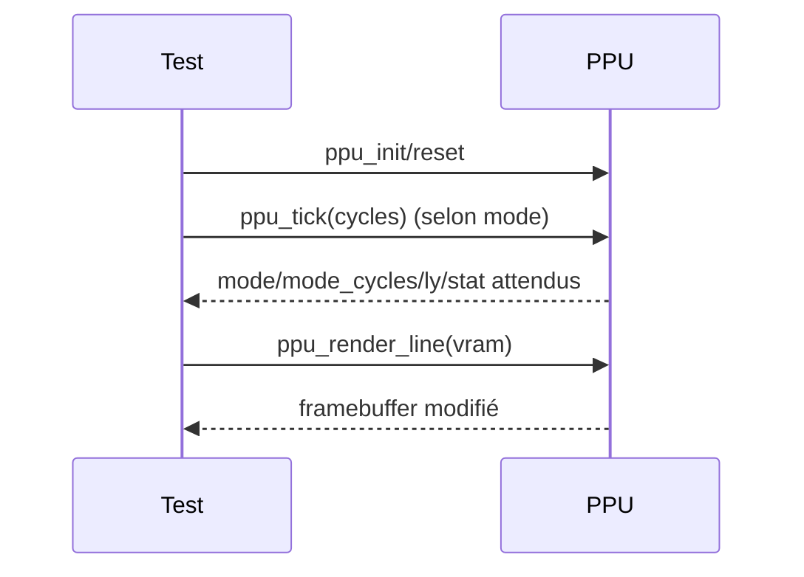

# PPU (Picture Processing Unit) – Spécifications d'implémentation

Retour: [Index specs](./README.md) · [Architecture](../architecture.md) · [Utilisation](../usage.md)

## 1) Principe de fonctionnement (Game Boy)

Le PPU génère l’image 160×144, ligne par ligne, à un rythme strict:
- 456 cycles par ligne, 144 lignes visibles, ~10 lignes VBlank (144–153)
- Modes par ligne: OAM Search (80) → Pixel Transfer (172) → HBlank (204)
- VBlank entre deux frames; VBlank IRQ à l’entrée en ligne 144

```mermaid
flowchart LR
  OAM[Mode 2: OAM search ~80] --> XFER[Mode 3: Pixel transfer ~172]
  XFER --> HBL[Mode 0: HBlank ~204]
  HBL -->|ligne+1| OAM
  VBL[Mode 1: VBlank (LY 144–153)] -->|retour| OAM
```

- STAT (0xFF41): bits 0–1 = mode; bit 2 = (LY==LYC)
- LCDC (0xFF40): contrôle BG/window/sprites, zones tile data/maps
- VRAM/OAM: accès CPU restreints pendant Mode 3 (VRAM) et Modes 2/3 (OAM)

Réfs Pan Docs: Graphics, LCD Control/Status, Rendering

---

## 2) Logique d’implémentation (CameBoy)

### État PPU
- Registres: `lcdc, stat, scy, scx, ly, lyc, bgp, obp0, obp1, wy, wx`
- État interne: `mode`, `mode_cycles`, `line_cycles`
- Framebuffer: `u32 framebuffer[160*144]`
- Palettes DMG dérivées de BGP/OBP0/OBP1 → `bg_palette[]`, `obj_palette0/1[]`

### Avancement (ppu_tick)
- Lignes visibles (0–143):
  - Mode 2 → 80 cycles; Mode 3 → 172 cycles (rendu de la ligne via `ppu_render_line`) → Mode 0 → fin de ligne
- VBlank (144–153): 456 cycles par ligne, retour à LY=0 puis Mode 2
- STAT mis à jour: `stat = (stat & 0xF8) | (mode & 0x03)`; LYC flag (bit2) selon `ly==lyc`
- Retour d’un masque IRQ (bit0=VBlank) pour signaler l’entrée en VBlank

### Rendu (simple DMG)
- `ppu_render_line`: BG uniquement (fenêtre/sprites non implémentés ici)
- Sélection tile map (`0x9800/0x9C00`) et tile data (`0x8000/0x8800`)
- Extraction d’un pixel 2‑bit (b1/b2) → mapping palette (BGP) → framebuffer

### Restrictions d’accès (côté MMU)
- VRAM bloquée en Mode 3; OAM bloquée en Modes 2/3 et pendant DMA OAM (voir MMU)

---

## 3) Stratégie de test (unitaires)

Tests dans `tests/unit/test_ppu.c`:
- Initialisation/Reset
  - `test_ppu_init`, `test_ppu_reset`: valeurs de registres (LCDC, STAT, BGP, LY=0), mode initial, buffers
- Registres (lecture/écriture)
  - `test_ppu_registers`: LCDC/STAT/SCY/SCX/LY/LYC/BGP/OBP/WY/WX
- Modes et timings
  - `test_ppu_modes`: transitions Mode 2→3→0 en respectant 80/172 cycles
  - `test_ppu_pixel_transfer`: que Mode 3 dure 172 cycles puis bascule Mode 0
  - `test_ppu_hblank`: fin de ligne → LY+1, retour Mode 2
  - `test_ppu_vblank`: entrée à LY=144, 10 lignes VBlank, retour LY=0/Mode 2
- Rendu
  - `test_ppu_render_line`: pixellisation d’une tuile simple depuis VRAM → framebuffer non‑blanc sur la ligne
- Palettes
  - `test_ppu_palettes`: dérivation des 4 niveaux de gris depuis BGP (et OBP0/1), `ppu_get_pixel_color`



Réfs Pan Docs: Modes & timings, STAT/LY/LYC, palettes DMG, mapping tile data/maps
