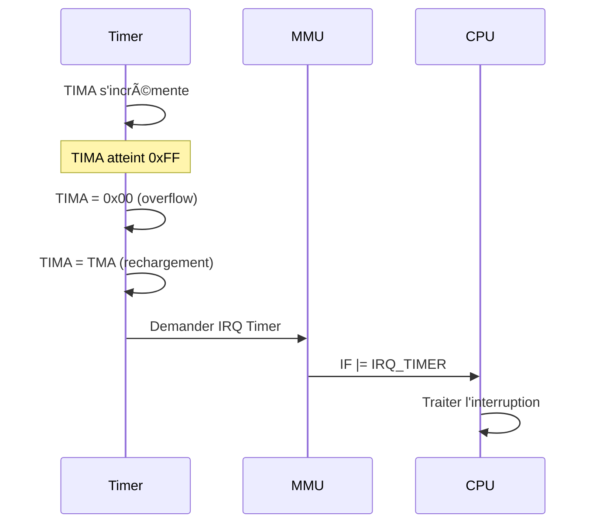

# Timers – Spécifications d'implémentation

Retour: [Index specs](./README.md) · [Architecture](../architecture.md) · [Tests](../testing.md)

## Vue d'ensemble

La Game Boy dispose de plusieurs compteurs temporels pour la synchronisation et les effets temporels. Le système de timers est crucial pour la compatibilité des jeux.

### Pourquoi des timers ?

Les timers servent à :
- **Synchronisation** : Mesurer le temps écoulé
- **Effets temporels** : Animations, délais, rythme de jeu
- **Interruptions** : Déclencher des événements à intervalles réguliers
- **Audio** : Générer des fréquences sonores

## Registres des timers

### DIV (0xFF04) - Divider Register
```c
#define DIV_REG 0xFF04

// DIV s'incrémente à 16384 Hz (fréquence fixe)
void timer_update_div(Timer* timer, u8 cycles) {
    timer->div_cycles += cycles;
    if (timer->div_cycles >= 256) {  // 4194304 / 16384 = 256
        timer->div_cycles -= 256;
        timer->div++;
    }
}
```

**Pourquoi 16384 Hz ?** C'est la fréquence de base du système, divisée par 256 depuis la fréquence CPU (4.194304 MHz).

### TIMA (0xFF05) - Timer Counter
```c
#define TIMA_REG 0xFF05

// TIMA s'incrémente selon la fréquence sélectionnée
void timer_update_tima(Timer* timer, u8 cycles) {
    if (!(timer->tac & 0x04)) return;  // Timer désactivé
    
    timer->tima_cycles += cycles;
    u16 threshold = timer_get_threshold(timer->tac);
    
    if (timer->tima_cycles >= threshold) {
        timer->tima_cycles -= threshold;
        timer->tima++;
        
        if (timer->tima == 0) {
            // Overflow : recharger depuis TMA et déclencher IRQ
            timer->tima = timer->tma;
            timer->overflow = true;
        }
    }
}
```

**Pourquoi un overflow ?** Quand TIMA atteint 0xFF, il repasse à 0x00 et déclenche une interruption. C'est le mécanisme principal pour les événements temporels.

### TMA (0xFF06) - Timer Modulo
```c
#define TMA_REG 0xFF06

// TMA contient la valeur de rechargement de TIMA
void timer_set_tma(Timer* timer, u8 value) {
    timer->tma = value;
}
```

**Pourquoi TMA ?** Permet de définir la période de l'interruption timer. TIMA se recharge avec TMA à chaque overflow.

### TAC (0xFF07) - Timer Control
```c
#define TAC_REG 0xFF07

// Bits de contrôle du timer
#define TAC_ENABLE 0x04  // Timer activé
#define TAC_CLOCK_MASK 0x03  // Sélection de fréquence

u16 timer_get_threshold(u8 tac) {
    switch (tac & TAC_CLOCK_MASK) {
        case 0: return 1024;  // 4096 Hz
        case 1: return 16;    // 262144 Hz
        case 2: return 64;    // 65536 Hz
        case 3: return 256;   // 16384 Hz
        default: return 1024;
    }
}
```

**Pourquoi ces fréquences ?** Différentes fréquences pour différents besoins :
- **4096 Hz** : Temps long (secondes)
- **65536 Hz** : Temps moyen (dizaines de millisecondes)
- **262144 Hz** : Temps court (millisecondes)
- **16384 Hz** : Temps de base (même que DIV)

## Comportement des timers

### Séquence d'overflow


### Gestion de l'overflow
```c
void timer_handle_overflow(Timer* timer, MMU* mmu) {
    if (timer->overflow) {
        timer->overflow = false;
        mmu_request_interrupt(mmu, IRQ_TIMER);
    }
}
```

**Pourquoi recharger immédiatement ?** C'est le comportement exact de la Game Boy. TIMA se recharge avec TMA dès l'overflow, pas après un délai.

## Comportements obscurs

### Écriture dans TIMA pendant l'incrémentation
```c
void timer_write_tima(Timer* timer, u8 value) {
    // Si TIMA est sur le point d'overflow et qu'on écrit dedans,
    // l'overflow peut être annulé
    if (timer->tima == 0xFF && timer->tima_cycles > 0) {
        // Comportement spécial : l'overflow peut être annulé
        timer->tima = value;
        timer->tima_cycles = 0;
    } else {
        timer->tima = value;
    }
}
```

**Pourquoi ce comportement ?** C'est un effet de bord du circuit matériel. Certains jeux s'appuient sur ce comportement.

### Écriture dans TAC
```c
void timer_write_tac(Timer* timer, u8 value) {
    bool was_enabled = timer->tac & TAC_ENABLE;
    bool is_enabled = value & TAC_ENABLE;
    
    timer->tac = value;
    
    // Si on active le timer et que TIMA est sur le point d'overflow,
    // l'overflow peut être déclenché immédiatement
    if (!was_enabled && is_enabled) {
        u16 threshold = timer_get_threshold(timer->tac);
        if (timer->tima_cycles >= threshold) {
            timer->tima++;
            if (timer->tima == 0) {
                timer->tima = timer->tma;
                timer->overflow = true;
            }
        }
    }
}
```

**Pourquoi ce comportement ?** L'activation du timer peut déclencher un overflow immédiat si les conditions sont réunies.

## Synchronisation avec le CPU

### Mise à jour des timers
```c
void timer_tick(Timer* timer, u8 cycles) {
    // Mettre à jour DIV (toujours actif)
    timer_update_div(timer, cycles);
    
    // Mettre à jour TIMA (si activé)
    timer_update_tima(timer, cycles);
    
    // Gérer l'overflow
    timer_handle_overflow(timer, mmu);
}
```

**Pourquoi synchroniser avec le CPU ?** Les timers doivent être mis à jour à chaque cycle CPU pour maintenir la synchronisation.

### Fréquences exactes
```c
// Fréquences des timers (en Hz)
#define DIV_FREQ 16384
#define TIMA_FREQ_4096 4096
#define TIMA_FREQ_65536 65536
#define TIMA_FREQ_262144 262144
#define TIMA_FREQ_16384 16384

// Calcul des seuils (cycles CPU par incrémentation)
#define DIV_THRESHOLD 256      // 4194304 / 16384
#define TIMA_THRESHOLD_4096 1024    // 4194304 / 4096
#define TIMA_THRESHOLD_65536 64     // 4194304 / 65536
#define TIMA_THRESHOLD_262144 16    // 4194304 / 262144
#define TIMA_THRESHOLD_16384 256    // 4194304 / 16384
```

**Pourquoi ces fréquences exactes ?** Elles sont calculées à partir de la fréquence CPU (4.194304 MHz) et des diviseurs matériels.

## Initialisation

```c
void timer_init(Timer* timer) {
    memset(timer, 0, sizeof(Timer));
    
    // Valeurs de power-up
    timer->div = 0xAB;    // DIV commence à 0xAB
    timer->tima = 0x00;   // TIMA commence à 0x00
    timer->tma = 0x00;    // TMA commence à 0x00
    timer->tac = 0xF8;    // TAC commence à 0xF8 (timer désactivé)
    
    timer->div_cycles = 0;
    timer->tima_cycles = 0;
    timer->overflow = false;
}
```

**Pourquoi ces valeurs ?** Ce sont les valeurs exactes de la Game Boy au démarrage, importantes pour la compatibilité.

## Tests de conformité

### Test d'overflow
```c
void test_timer_overflow() {
    Timer timer;
    timer_init(&timer);
    
    // Activer le timer à 4096 Hz
    timer.tac = 0x05;  // 4096 Hz, activé
    
    // Simuler 1024 cycles (1 incrémentation)
    timer_tick(&timer, 1024);
    assert(timer.tima == 1);
    
    // Simuler jusqu'à l'overflow
    for (int i = 0; i < 255; i++) {
        timer_tick(&timer, 1024);
    }
    
    assert(timer.tima == 0);  // Overflow
    assert(timer.overflow == true);
}
```

**Pourquoi ces tests ?** Ils vérifient que le comportement des timers est conforme aux spécifications.

## Références Pan Docs

- [Timer and Divider Registers](https://gbdev.io/pandocs/Timer_and_Divider_Registers.html)
- [Timer Obscure Behaviour](https://gbdev.io/pandocs/Timer_Obscure_Behaviour.html)

### Modèle edge-based des timers

- Compteur interne 16-bit (diviseur) incrémenté à 4.194304 MHz.
- `DIV` lit les 8 bits hauts (counter >> 8).
- `TIMA` s’incrémente sur front descendant d’un bit du compteur choisi par `TAC`:
  - `TAC[1:0]=00` ? bit9 (4096 Hz)
  - `01` ? bit3 (262144 Hz)
  - `10` ? bit5 (65536 Hz)
  - `11` ? bit7 (16384 Hz)
- Overflow: `TIMA` recharge `TMA` et déclenche IRQ Timer. Les subtilités (glitches, délais) pourront être détaillées plus tard.

Dans CameBoy, on modélise ces fronts via `div_counter` (16-bit) et `prev_input_bit`. On conserve en parallèle des compteurs « pédagogiques » pour garder des tests lisibles.
